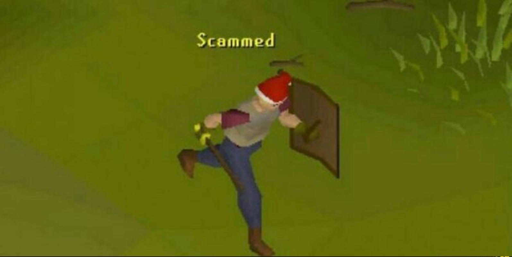
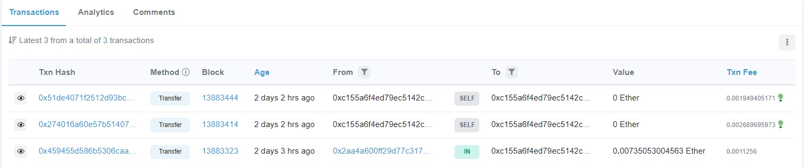

import { T } from "../../../src/components/Markdown"

import narigon from "./narigon.png"
import scammer from "./scammer.jpg"

import kekw from "@assets/emotes/kekw.png"

export const narigonProps = {
  username: "narigon",
  roleColor: "red.300",
  avatar: narigon,
}

export const scammerProps = {
  username: "Kertrud",
  roleColor: "orange.500",
  avatar: scammer,
}

export const messages = [
  {
    message: "Hello, are you this person? <link to profile>",
    username: "narigon",
    other: false,
    timestamp: 1637114581279,
  },
  {
    message: "no",
    username: "Scammer",
    highlight: true,
    other: true,
    timestamp: 1640527904373,
  },
  {
    message: "Gotcha, thanks",
    username: "narigon",
    other: false,
    timestamp: 1640538791753,
  },
  {
    message: "ou man",
    username: "Scammer",
    other: true,
    timestamp: 1640540162567,
  },
  {
    message: "srryy",
    username: "Scammer",
    other: true,
    timestamp: 1640540164456,
  },
  {
    message: "yes, thats me",
    highlight: true,
    username: "Scammer",
    other: true,
    timestamp: 1640540168741,
  },
  {
    message: "but i dont speak english",
    username: "Scammer",
    other: true,
    timestamp: 1640540177800,
  },
  {
    message: "its me",
    username: "Scammer",
    other: true,
    timestamp: 1640540188062,
  },
  {
    message: "Okay",
    username: "narigon",
    other: false,
    timestamp: 1640540381798,
  },
  {
    message: "What language do you speak?",
    username: "narigon",
    other: false,
    timestamp: 1640540390517,
  },
  {
    message: "spanish",
    username: "Scammer",
    other: true,
    timestamp: 1640543916338,
  },
  {
    message:
      'Okay, so... "narigon" is my online identity and I was wondering if you would be kind enough to allow me to use that name in my <redacted> profile.',
    username: "narigon",
    other: false,
    timestamp: 1640553347248,
  },
  {
    original: "Entiendo si quieres quedártelo, aunque :)",
    message: "I understand if you want to keep it, though :)",
    username: "narigon",
    other: false,
    timestamp: 1640553384995,
  },
  {
    original: "Para que conste, aquí está el sitio web de mi blog.",
    message: "For the record, here is my blog website",
    username: "narigon",
    other: false,
    timestamp: 1640553436481,
  },
  {
    message: "http://narigon.dev",
    username: "narigon",
    other: false,
    timestamp: 1640553464042,
  },
  {
    original:
      "Dale, no hay problema, pero necesito una paga, ya que seria dejar un lugar que consegui desde mi antiguedad",
    message: "Come on, no problem, but I need a payment.",
    username: "Scammer",
    other: true,
    timestamp: 1640554007339,
  },
  {
    original: "está bien, ¿cuánto quieres por él?",
    message: "Okay, how much do you want for it?",
    username: "narigon",
    other: false,
    timestamp: 1640554051758,
  },
  {
    username: "Scammer",
    highlight: true,
    message: "30 dollars so I can buy some medicine",
    original:
      "Oh this seems fair. I'll get my nickname and the dude gets their medicine :)",
    other: true,
    timestamp: 1640554262394,
  },
  {
    original: "Suena bien. ¿Dónde quieres que haga el pago?",
    message: "Sounds good. Where do you want me to make the payment?",
    username: "narigon",
    other: false,
    timestamp: 1640554377955,
  },
  {
    original: "tenes metamask?",
    message: "You got Metamask?",
    username: "Scammer",
    other: true,
    timestamp: 1640554392131,
  },
  {
    message: "Ethereum is fine 👌",
    username: "narigon",
    other: false,
    timestamp: 1640554404771,
  },
  {
    original: "si",
    message: "Yes",
    username: "Scammer",
    other: true,
    timestamp: 1640554422061,
  },
  {
    message: "Give me your ETH address",
    message: "Give me your ETH address",
    username: "narigon",
    other: false,
    timestamp: 1640554427962,
  },
  {
    username: "Scammer",
    message: "0xc155...",
    other: true,
    timestamp: 1640554445056,
  },
  {
    message: "<link on etherscan blockchain explorer to the transaction>",
    username: "narigon",
    other: false,
    timestamp: 1640554654592,
  },
  {
    message:
      "I did not get anything, yes, there I am changing it, I am waiting for the confirmation",
    original:
      "No me llego nada, si, ahi lo estoy cambiando, estoy esperando la confirmacion",
    username: "Scammer",
    other: true,
    timestamp: 1640554863339,
  },
  {
    original: "En que moneda me lo mandaste, no llega nada",
    message: "In what currency did you send it to me, nothing comes",
    username: "Scammer",
    other: true,
    timestamp: 1640554980063,
  },
  {
    original:
      "ethereum. Todavía lo está confirmando. Puedes ver la transacción en Etherscan",
    message:
      "Ethereum. It's still confirming. You can see the transaction on Etherscan.",
    username: "narigon",
    other: false,
    timestamp: 1640555044345,
  },
  {
    message: "It's confirmed now :)",
    username: "narigon",
    other: false,
    timestamp: 1640555183234,
  },
  {
    message: "yes!",
    username: "Scammer",
    highlight: true,
    other: true,
    timestamp: 1640555208770,
  },
  {
    message: "Hello?",
    username: "narigon",
    other: false,
    timestamp: 1640556017932,
  },
  {
    original: "¿Hablas en serio?",
    message: "Are you serious?",
    username: "narigon",
    other: false,
    timestamp: 1640556259744,
  },
  {
    message: "wait a second",
    username: "Scammer",
    other: true,
    timestamp: 1640556400033,
  },
  {
    original: "OK, dime si necesitas ayuda para cambiarlo.",
    message: "Okay, tell me if you need help changing it.",
    username: "narigon",
    other: false,
    timestamp: 1640556548008,
  },
  {
    message: "u are a scam, no?",
    username: "Scammer",
    other: true,
    timestamp: 1640556694344,
  },
  {
    message: "...",
    username: "Scammer",
    other: true,
    timestamp: 1640556696092,
  },
  {
    message: "No??",
    username: "narigon",
    other: false,
    timestamp: 1640556708622,
  },
  {
    message: "I have sent you a link to the transaction, with your address.",
    username: "narigon",
    other: false,
    timestamp: 1640556738092,
  },
  {
    original: "¿Cómo te estafaría? Solo estoy tratando de comprarte mi apodo",
    message: "How would I rip you off? I'm just trying to buy my nickname",
    username: "narigon",
    other: false,
    timestamp: 1640556778790,
  },
  {
    original:
      "el eth que mandaste no existe, esta trabado en la red, no me deja moverlo...",
    message:
      "the eth you sent does not exist, it is stuck in the network, it won't let me move it...",
    username: "Scammer",
    other: true,
    timestamp: 1640556841742,
  },
  {
    original: "estafador",
    message: "Swindler",
    highlight: true,
    username: "Scammer",
    other: true,
    timestamp: 1640556852116,
  },
  {
    message: "I can assure you it is in your account",
    username: "narigon",
    other: false,
    timestamp: 1640556862694,
  },
  {
    message: "<link to their account in etherscan>",
    username: "narigon",
    other: false,
    timestamp: 1640556899277,
  },
  {
    message: "eth bug",
    username: "Scammer",
    other: true,
    timestamp: 1640556947193,
  },
  {
    original:
      "ya ha realizado 3 transacciones, ¿qué quiere decir con que no puede moverlo?",
    message:
      "You have already made 3 transactions, what do you mean you cannot move it?",
    username: "narigon",
    highlight: true,
    other: false,
    timestamp: 1640556948598,
  },
  {
    message: "...",
    username: "Scammer",
    other: true,
    timestamp: 1640556952043,
  },
  {
    original: "estafador",
    message: "Scammer",
    username: "Scammer",
    other: true,
    timestamp: 1640556962920,
  },
  {
    original: "no me hables, fui amable contigo y mira como me pagas",
    message: "don't talk to me, I was nice to you and look how you pay me",
    username: "Scammer",
    other: true,
    timestamp: 1640556987781,
  },
  {
    message: "No... I made a honest transaction and you can see it",
    username: "narigon",
    other: false,
    timestamp: 1640556994347,
  },
  {
    message: "see, its bug",
    username: "Scammer",
    other: true,
    timestamp: 1640557044263,
  },
  {
    original: "no te preocupes, aqui el estafador fuiste tu",
    message: "do not worry, here the scammer was you",
    username: "Scammer",
    other: true,
    timestamp: 1640558171008,
  },
  {
    original:
      "¿Qué te hace pensar que soy un estafador? Creo que simplemente no sabes cómo usar Ethereum / Metamask.",
    message:
      "What makes you think I'm a scammer? I think you just don't know how to use Ethereum / Metamask.",
    username: "narigon",
    other: false,
    timestamp: 1640558233252,
  },
  {
    original:
      "Hiciste dos transacciones en tu propia dirección ... Se denominan transacciones automáticas. Entonces, todo lo que sucedió fue que quemó la tarifa. ¿Por qué hiciste eso?",
    message:
      "You made two transactions at your own address... They are called self transactions. So all that happened was that you burned the network fee. Why did you do that?",
    username: "narigon",
    other: false,
    timestamp: 1640558433246,
  },
  {
    message: ":(",
    username: "Scammer",
    other: true,
    timestamp: 1640560954369,
  },
  {
    message:
      "It's not my fault that you are so incompetent with Ethereum that you can't even transfer the money.",
    original:
      "No es mi culpa que seas tan incompetente con Ethereum que ni siquiera puedas transferir el dinero.",
    username: "narigon",
    other: false,
    timestamp: 1640706432748,
  },
  {
    original: "No creo ni por un segundo que ya seas dueño de la cuenta.",
    message: "I don't believe that you really own the account.",
    username: "narigon",
    other: false,
    timestamp: 1640706498844,
  },
  {
    original:
      "mandaste 30 dolares por una red que no aparece en los sistemas para que una persona cambiara su apodo de una pagina",
    message:
      "you sent 30 dollars for a network that does not appear in the systems so that a person will change their nickname of a page",
    username: "Scammer",
    other: true,
    timestamp: 1640707131617,
  },
  {
    original:
      "como vas a mandar dinero sin comprobar que sea de verdad la persona jajajja, igual el dinero quedo ahi en la cuenta, cuando quieras te lo devuelvo",
    message:
      "How are you going to send money without checking that it is really the person hahaha, the money is still there in the account, whenever you want I will give it back to you",
    username: "Scammer",
    other: true,
    timestamp: 1640707210274,
  },
  {
    original: "pero no pude sacar el dinero",
    message: "but I couldn't get the money",
    username: "Scammer",
    other: true,
    timestamp: 1640707253526,
  },
  {
    message: "xD",
    username: "Scammer",
    other: true,
    timestamp: 1640707342247,
  },
  {
    original: "para vos es poco dinero, para mi es una cantidad muy grande",
    message: "for you it is little money, for me it is a very large amount",
    username: "Scammer",
    other: true,
    timestamp: 1640707394902,
  },
  {
    original:
      "y vos, como programador, porfavor revisa antes de enviar dinero a alguien",
    message:
      "and you, as a programmer, please check before sending money to someone",
    username: "Scammer",
    other: true,
    timestamp: 1640707533695,
  },
  {
    original: "¿Tiene alguna prueba de que es propietario de la cuenta?",
    message: "Do you have any proof that you own the account?",
    username: "narigon",
    other: false,
    timestamp: 1640707541273,
  },
  {
    original: "la cuenta es mia",
    message: "the account is mine",
    username: "Scammer",
    other: true,
    timestamp: 1640707549861,
  },
  {
    original: "prefiero no seguir hablando con vos",
    message: "I prefer not to continue talking to you",
    username: "Scammer",
    other: true,
    timestamp: 1640707856603,
  },
  {
    original: "no se nada",
    message: "I know nothing",
    username: "Scammer",
    other: true,
    timestamp: 1640708036820,
  },
  {
    original: "no estudio informatica",
    message: "I do not study computer science",
    username: "Scammer",
    other: true,
    timestamp: 1640708041292,
  },
  {
    original: "no creo en dios",
    message: "I do not believe in God",
    highlight: true,
    username: "Scammer",
    other: true,
    timestamp: 1640708044218,
  },
  {
    original: "y no soy dueño de la cuenta",
    message: "and I do not own the account",
    highlight: true,
    username: "Scammer",
    other: true,
    timestamp: 1640708049931,
  },
  {
    original: "la persona de mi foto no soy yo, mi nombre no es <redacted>",
    message: "the person in my photo is not me, my name is not <redacted>",
    username: "Scammer",
    other: true,
    timestamp: 1640708061473,
  },
  {
    original: "y no hablo español",
    message: "(in spanish) and I do not speak spanish",
    highlight: true,
    username: "Scammer",
    other: true,
    timestamp: 1640708082415,
  },
  {
    message: "ty for 30 <3",
    username: "Scammer",
    other: true,
    timestamp: 1640708200144,
  },
  {
    message: "Oh. Well that was interesting.",
    username: "narigon",
    other: false,
    timestamp: 1640708200145,
  },
  {
    message:
      'you are a great person, a bit annoying and arrogant, but without bad intentions, I hope you can get your nickname, which by the way "Narigon" in Spanish means having a very big nose',
    username: "Scammer",
    other: true,
    timestamp: 1640708454750,
  },
  {
    message: "Yeah I'm aware. It fits me perfectly.",
    username: "narigon",
    other: false,
    timestamp: 1640708465844,
  },
]

export const chunkedMessages = messages.reduce(function (
  accumulator,
  currentValue,
  indx
) {
  if (
    accumulator[accumulator.length - 1] &&
    currentValue.username === accumulator[accumulator.length - 1].username
  ) {
    accumulator[accumulator.length - 1].message.push({
      content: currentValue.message,
      highlight: currentValue.highlight,
      original: currentValue.original,
    })
  } else {
    accumulator.push({
      ...currentValue,
      message: [
        {
          content: currentValue.message,
          highlight: currentValue.highlight,
          original: currentValue.original,
        },
      ],
    })
  }
  return accumulator
},
[])

I've had various nicknames.
I've been liking this nickname, <T>narigon</T> enough to the point I'd like to make it my online persona.

Nicks usually go on a first-come first-serve basis. However, there's one service where I'd really love to have my nickname.
Quickly I found myself looking for the person who owned the nickname.
I started with Instagram, moved on to Facebook where I thought I had found the right person. Turns out I was wrong.

<FacebookContainer>
  {chunkedMessages.slice(0, 1).map(e => (
    <FacebookMessage
      color="rgb(120, 159, 115)"
      messages={e.message}
      avatar={e.other ? scammerProps.avatar : narigonProps.avatar}
      other={e.other}
    />
  ))}
</FacebookContainer>

A few weeks went by without them reading the message. Then on a fateful Monday evening:

<FacebookContainer>
  {chunkedMessages.slice(1, 4).map(e => (
    <FacebookMessage
      color="rgb(120, 159, 115)"
      messages={e.message}
      avatar={e.other ? scammerProps.avatar : narigonProps.avatar}
      other={e.other}
    />
  ))}
</FacebookContainer>

export const TranslateToast = () => (
  <Toastable text="Google Translate" color="blue.300">
    You can hover the "Facebook Messages" to see the original untranslated text.
  </Toastable>
)

Turns out there's a language barrier. This made me think that the person genuinely owns the account, maybe they misunderstood my question due to said barrier?

From this point on, the messages will be translated using <TranslateToast/>

I believe in human kindness. Statistically speaking, I think the percentage of people who would scam you in this situation is pretty low.
His real name in a way forms my nickname <T>narigon</T>. I think it's pretty unlikely that a person would use this chance to scam me? There's not many people who have the same nickname. Even fewer people contact a person on the internet asking to buy their account name.

<FacebookContainer>
  {chunkedMessages.slice(4, 11).map(e => (
    <FacebookMessage
      color="rgb(120, 159, 115)"
      messages={e.message}
      avatar={e.other ? scammerProps.avatar : narigonProps.avatar}
      other={e.other}
    />
  ))}
</FacebookContainer>

That seems reasonable! I'm happy that I'm working with such a professional. Happy to also help a person in need.

## The transaction

<FacebookContainer>
  {chunkedMessages.slice(11, 15).map(e => (
    <FacebookMessage
      color="rgb(120, 159, 115)"
      messages={e.message}
      avatar={e.other ? scammerProps.avatar : narigonProps.avatar}
      other={e.other}
    />
  ))}
</FacebookContainer>

Should've known better. I thought they don't have PayPal in the country they're from. Luckily I have around 50 dollars in Ethereum.

<FacebookContainer>
  {chunkedMessages.slice(15, 20).map(e => (
    <FacebookMessage
      color="rgb(120, 159, 115)"
      messages={e.message}
      avatar={e.other ? scammerProps.avatar : narigonProps.avatar}
      other={e.other}
    />
  ))}
</FacebookContainer>

At this point, around 30 minutes has passed. I start snooping around in their address to see if they're already trying to move the money.

Looks like they're pretty clueless. They have made two self transactions, presumably attempting to move the money somewhere else. They now only have around 10 dollars in their balance after all the network fees.

<FacebookContainer>
  {chunkedMessages.slice(20, 29).map(e => (
    <FacebookMessage
      color="rgb(120, 159, 115)"
      messages={e.message}
      avatar={e.other ? scammerProps.avatar : narigonProps.avatar}
      other={e.other}
    />
  ))}
</FacebookContainer>

export const EthBug = () => (
  <Box pb={2}>
    <Text display="inline" mr="1rem">Oh, what a turn of events. I've sent him "an ETH bug"</Text>
    <Image src={kekw} display="inline" htmlWidth="35px" verticalAlign="top" />
  </Box>
)

<EthBug />
I think if you're running these kind of scams, you should atleast have some competence in actually moving the money. Dude gained 10 dollars from an hour of work.

## The revelation

At this point, he seems to get pretty angry.

<FacebookContainer>
  {chunkedMessages.slice(29, 36).map(e => (
    <FacebookMessage
      color="rgb(120, 159, 115)"
      messages={e.message}
      avatar={e.other ? scammerProps.avatar : narigonProps.avatar}
      other={e.other}
    />
  ))}
</FacebookContainer>

Thanks for the advice.

<FacebookContainer>
  {chunkedMessages.slice(36, 39).map(e => (
    <FacebookMessage
      color="rgb(120, 159, 115)"
      messages={e.message}
      avatar={e.other ? scammerProps.avatar : narigonProps.avatar}
      other={e.other}
    />
  ))}
</FacebookContainer>

Looks like the money is gone. Wouldn't have thought that scammers can get this opportunistic.

Atleast I owned up to the nickname:

<FacebookContainer>
  {chunkedMessages.slice(39, 41).map(e => (
    <FacebookMessage
      color="rgb(120, 159, 115)"
      messages={e.message}
      avatar={e.other ? scammerProps.avatar : narigonProps.avatar}
      other={e.other}
    />
  ))}
</FacebookContainer>

Thank you for reading this dumpster fire, and have a good rest of your day.
