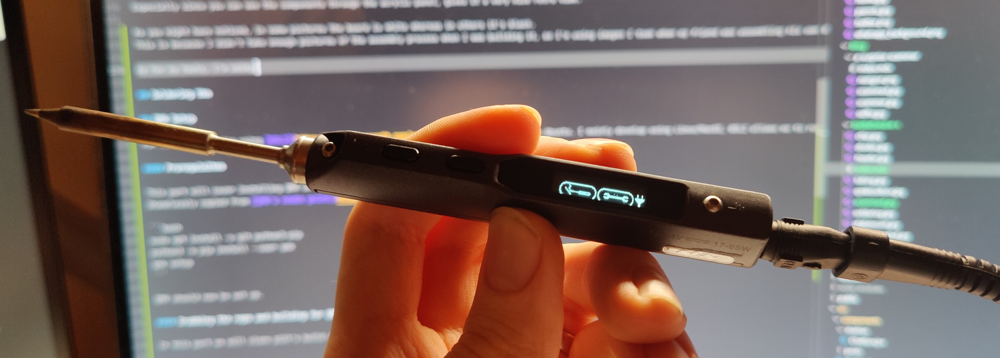
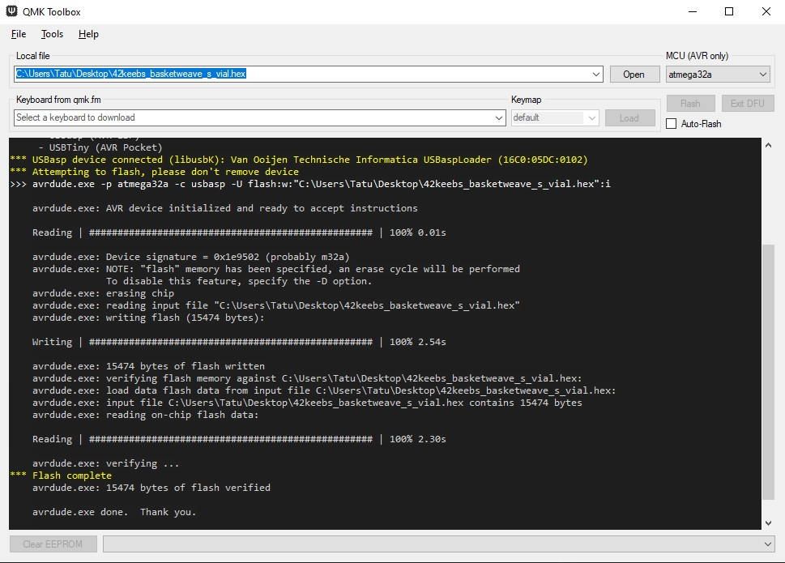
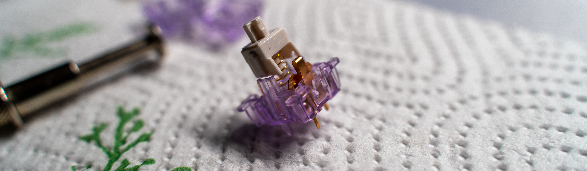
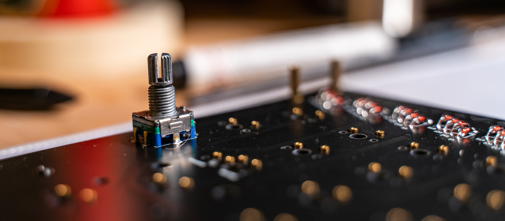
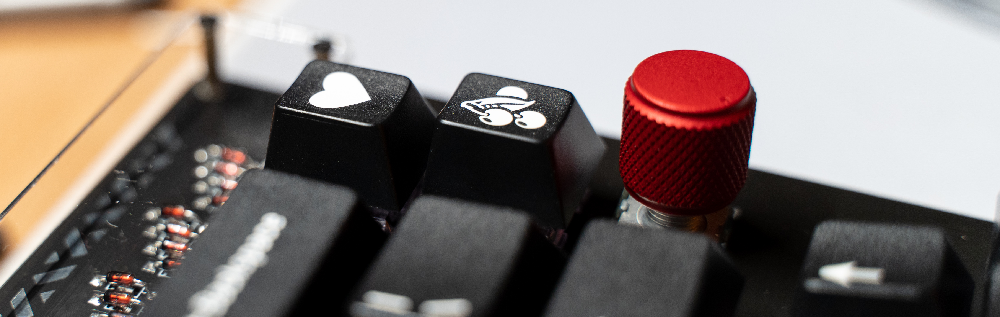
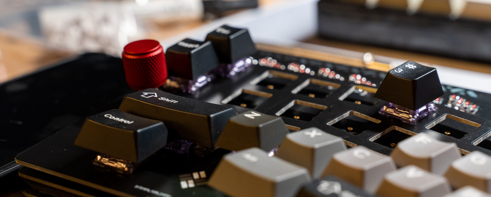

import { T } from "../../../src/components/Markdown"
import { RiExternalLinkLine } from "react-icons/ri"

export const Toast = ({ text, children }) => (
  <Toastable text={children} color="blue.300">
    {text}
  </Toastable>
)

export const Requirement = ({ type, children, optional }) => {
  let borderColor
  switch (type) {
    case "optional":
      borderColor = "kbOptional"
      break
    case "tool":
      borderColor = "kbTool"
      break
    default:
      borderColor = "kbRequired"
  }
  return (
    <Box display="block" mb={1}>
      <li>
        <Box
          bg={optional ? null : borderColor}
          pl={2}
          pr={2}
          borderRadius={5}
          boxShadow={
            optional && "0px 0px 0px 2px var(--chakra-colors-kbTool) inset"
          }
          display="inline-block"
        >
          {children}
        </Box>
      </li>
    </Box>
  )
}

export const ColorDescription = ({ type, children, optional }) => {
  let borderColor
  switch (type) {
    case "optional":
      borderColor = "kbOptional"
      break
    case "tool":
      borderColor = "kbTool"
      break
    default:
      borderColor = "kbRequired"
  }
  return (
    <Box
      bg={optional ? null : borderColor}
      pl={1}
      mr={1}
      pr={1}
      borderRadius={3}
      boxShadow={
        optional && "0px 0px 0px 2px var(--chakra-colors-kbTool) inset"
      }
      display="inline-block"
    >
      {children}
    </Box>
  )
}

export const PartsList = () => (
  <Box bg="bgSecondary" p={4} mb={5} fontSize="md" w="100%">
    <b>The kit comes with:</b>
    <ul>
      <li>Main PCB </li>
      <li>Bottom plate (FR4 material)</li>
      <li>Switch plate (FR4)</li>
      <li>All electronic components </li>
      <li>Controller flashed with USBaspLoader</li>
      <li>
        1x{" "}
        <Link href="https://42keebs.eu/shop/parts/ec11-rotary-encoder/">
          EC11 rotary encoder
        </Link>
      </li>
      <li>Brass standoffs and screws</li>
      <li>Acrylic cover</li>
    </ul>
    <br />
    <i>
      <b>In addition to that, you will need</b>
    </i>
    <ul>
      <Requirement>5x 2u PCB mount stabilizers</Requirement>
      <Requirement>Keycaps (check for compatibility)</Requirement>
      <Requirement>69-71 Compatible switches (5pin)</Requirement>
      <Requirement type="optional">
        <Link>
          Second EC11 rotary encoder
        </Link>
      </Requirement>
      <Requirement type="optional">
        <Link href="https://42keebs.eu/shop/parts/aluminium-cone-feet/">
          Aluminium cone feet
        </Link>
      </Requirement>
      <Requirement type="optional">
        <Link href="https://42keebs.eu/shop/parts/anodised-aluminium-encoder-knobs/">
          Encoder knobs
        </Link>
      </Requirement>
      <Requirement type="tool">Soldering iron and solder</Requirement>
      <Requirement type="tool">Phillips head screwdriver</Requirement>
      <Requirement type="tool">Flush side cutters</Requirement>
      <Requirement type="tool" optional>
        No-clean flux for soldering USB-C port
      </Requirement>
      <Requirement type="tool">USB Type C cable</Requirement>
    </ul>
    <Text fontSize="xs">
      Color descriptions: <ColorDescription>Required</ColorDescription>
      <ColorDescription type="optional">Optional</ColorDescription>
      <ColorDescription type="tool">
        Tool
      </ColorDescription>
      <ColorDescription type="tool" optional>
        Depends
      </ColorDescription>
    </Text>
  </Box>
)


Hello! In this blog post, we'll be going through the build process of the <T>Basketweave-S</T> mechanical keyboard.

#### Links
[DIY kit on 42keebs.eu](https://42keebs.eu/shop/kits/basketweave-s-ergo-65-kit-black)  
[Build guide](https://github.com/piit79/basketweave-s/blob/master/doc/build.md)  
[QMK fork](https://github.com/piit79/qmk_firmware)

## About the board

The Basketweave-S is a 75% mechanical keyboard with Alice-like layout.

Below I've listed everything you will need to turn it from a board into a working mechanical keyboard

As for this build, the parts we will be using are the following:  
**Switches: Durock Lavender, 65g**  
**Lube: Krytox 205g0 and 105 for springs**  
**Films: Deskeys films**  
**Keycaps: [ePBT Shadow Version A](https://kbdfans.com/products/ic-epbt-shadow)**  
<PartsList />

As for my tools, I'm using a TS100 soldering iron.



## Introduction

I've always wanted to try out an Alice-style board. I think they look cool.
I don't believe they are any better than a standard keyboard layout from an ergonomical viewpoint, but they have this very nice <T>aesthetic</T> to them.
Especially since you can see the components through the acrylic panel, gives it a very nice retro vibe. Also worth noting that the **revision of my board is 1.9**, and I used the **USB-C soldering service** that piit79 offered.

As you might have noticed, in some pictures the board is white whereas in others it's black.
This is because I didn't take enough pictures of the assembly process when I was building it, so I'm using images I took when my friend was assembling his own Basketweave-S at my place.

<br />

#### Soldering the area around the MCU
This part is straightforward, just follow the build guide and make sure to pay attention to the orientation of the components as stated in the build guide.

For inserting the ATmega32a, the pins might be a bit too "wide" around the socket. This is easily remedied by pushing the flat side of the pins against the table so they turn _slightly_ inwards.


Once you're done soldering this, we're ready to move on to installing [QMK](#qmk)

<br />

## QMK

For my QMK setup, I'm using [WSL2](https://docs.microsoft.com/en-us/windows/wsl/install) with Ubuntu. I mainly develop using Linux/MacOS, WSL2 allows me to run Linux tooling on my main gaming PC.

You might also be wondering, <Toast text="QMK is an open source keyboard firmware software project.">what the hell is QMK?</Toast>  

#### Prerequisites

This part will cover installing QMK on WSL2 with Ubuntu.
Shamelessly copied from [QMK's newbs guide](https://docs.qmk.fm/#/newbs_getting_started) so this may be subject to change.

```bash
sudo apt install -y git python3-pip
python3 -m pip install --user qmk
qmk setup
```

QMK should now be set up.

#### Building for QMK

In this part we will clone piit's build of QMK with the firmware for the Basketweave-S and build it.

```
qmk clone piit79/qmk_firmware
qmk compile -kb 42keebs/basketweave_s -km default
```

This will output a `42keebs_basketweave_s_default.hex` file into `~/qmk_firmware` if you installed QMK into the default location.

#### For <Toast text="Vial is an open-source cross-platform (Windows, Linux and Mac) GUI and a QMK fork for configuring your keyboard in real time. ">Vial</Toast>

There is a pull request on piit's fork of QMK for adding <Toast text="Vial is an open-source cross-platform (Windows, Linux and Mac) GUI and a QMK fork for configuring your keyboard in real time.">Vial</Toast>
support.  
[QMK fork of piit's fork, for Vial support](https://github.com/IvoPo/qmk_firmware/tree/basketweave-s-vial)

These instructions will help you install Vial support, in case it's not merged by the time this post is published.

```bash
qmk clone IvoPo/qmk_firmware
cd ~/qmk_firmware
git checkout basketweave-s-vial
# -km can either be default or vial
qmk compile -kb 42keebs/basketweave_s -km vial
```

# Flashing firmware

If you're using [QMK Toolbox](https://github.com/qmk/qmk_toolbox), you can simply point the `Local file` to the compiled `.hex` file. **Remember to select ATmega32a for the MCU.** 

If your Basketweave-S is not showing up as a connected device, try holding the **boot** button on the top of the PCB to put it into bootloader mode when plugging in the USB-C cable.



<Caption>A successful flash.</Caption>

#### Flashing on Linux using QMK
I haven't tried this myself, but you should be able to flash it onto the MCU from the command line by running:
```bash
cd ~/qmk_firmware
# For QMK
make -kb 42keebs/basketweave_s:default:flash
# For Vial
make -kb 42keebs/basketweave_s:vial:flash
```

<br />

#### Diodes


So the MCU works. That means it's time to put on some diodes!

This part might take a while. There's a diode for every switch, so there's 71 diodes (+ a few additional for the encoders). I just put in around 20 at a time and then soldered.
Depending on your speed this might take an hour / a few hours. I was very lazy so it took me around 2.5 hours to do.

#### Stabilizers


For the acoustics of the board (<T>yes, keyboard nerds care about that</T>) I wanted to get some premium stabilizers. I opted to use some Durock V2 screw in stabilizers.

To prepare the stabs, there's a few steps. Let's start with the <Toast text="A really cringe name for just putting bandaid inside your stabilizers.">"holee mod"</Toast>.
<Box
  as="iframe"
  mb={6}
  borderRadius="md"
  width="100%"
  height="405px"
  src="https://www.youtube-nocookie.com/embed/-vhpHjlkRgQ"
  title="YouTube video player"
  frameborder="0"
  allow="accelerometer; autoplay; clipboard-write; encrypted-media; gyroscope; picture-in-picture"
  allowfullscreen
/>

<Caption>To summarize - you just put some bandaid in there.</Caption>

Now to anyone who is not into mechanical keyboards, this might sound pretty stupid. Now that I've tested it, **I can assure you that it works!** The stabilized keys sound so much nicer after. I guess it's because the balancing wire inside the stabilizer is now neatly cushioned between lubricated plastic and the bandaid.

I also wanted to pamper myself so I got myself some stab foam. You put this between the PCB and the stabilizer to dampen the sound of the stabilizer hitting the PCB when you press the key.

Now after all of that is done, time to screw on the stabs.


#### Switches
This is the part that most mechanical keyboard enthusiasts hate. It's called lubing the switches.

Believe me, the first time I heard people do this I thought they were some kind of nutjobs. But I did it for my second mechanical keyboard I modified and noticed a significant difference in smoothness! If you have the time to do it, it's definitely worth it. I wanted to splurge on this board so I spent a lot of time doing this.


<Caption>Lubing the stem</Caption>

To lubricate a mechanical keyboard switch, you first take it apart using something called a <T>switch opener</T>. You'll be able to pop out the individual parts. Here's what a single switch consists of:

* Top housing
* Stem
* Spring
* Bottom housing  

<br />

To save some time lubing the switches, I used a method called bag lubing. That means you open up all the switches and put them in a plastic bag or some kind of a closed container, put in some lube and _**vigorously**_ shake for around 10 minutes. 

Then you do a pass around on the bottom housing, put in the spring, take the stem and put a tiny even coat around it. There's a saying in the keyboard community that goes _"less is more"_, simply because it's annoying to fix an overlubed switch.


<Caption>A switch ready to be filmed.</Caption>

Filming is done to make the top housing sit snug on the bottom housing. I don't know if this actually makes any difference for acoustics but I decided to do it anyways.

## Putting it all together
You may have noticed that the white PCB looks a bit different than mine. That's because I'm using <Toast text="Hotswap sockets allow me to remove and add switches without having to do any soldering.">hotswap sockets</Toast>. For my friend's build, at this point we put on the encoders and soldered in the switches.

In my case, since I already soldered in the sockets, I only have to solder in the encoders.



After that, it's time to pop in the switches. I was really lazy with the lubing process. I was basically doing 10 switches at once and then putting them in the keyboard just to see the progress. 


<Caption>The table got pretty messy during the build process.</Caption>

#### End result
Here's some pretty images of the finished build:






#### Experiences with Alice layout
import { RiChat1Fill } from "react-icons/ri"

<Callout icon={<RiChat1Fill />} title="Footnote">
  <Text color="text.300" fontSize="md">
		I released this post on the same day I finished the build. I'll update this section (or maybe make a new blog post) once I have used the layout for a bit and have a feel for how I like it.
  </Text>
</Callout>