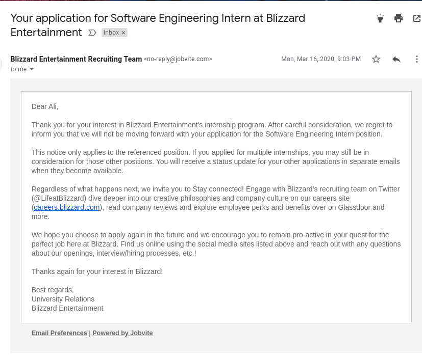

In 2017 I moved to California to live with my mom and go to one of the nearby community colleges to study computer science. One of the things I couldn't stop thinking about when I got there was the fact that my mom lived 10 minutes away from the Blizzard Headquarters in Irvine.

<iframe src="https://www.google.com/maps/embed?pb=!1m18!1m12!1m3!1d106287.6497335395!2d-117.82212765814606!3d33.644487858766404!2m3!1f0!2f0!3f0!3m2!1i1024!2i768!4f13.1!3m3!1m2!1s0x80dcde82907fe8bb%3A0xcb7104743d635730!2sBlizzard%20Entertainment!5e0!3m2!1sen!2sus!4v1627808390530!5m2!1sen!2sus" width="800" height="600" style="border:0;" allowfullscreen="" loading="lazy"></iframe>

It felt surreal, but when I checked the map for the first time, it was there in all of its glory, no cap. All fax no printer. The company that makes the game I've been obsessed with for years as a kid, standing a very exhausting jogging distance away from the bed I go to sleep on every day.

Because I had only just gotten into programming at the time, I couldn't even fathom the idea of trying to get in contact with someone working there or applying for a position/internship. So for the next three years, I went past the Blizzard HQ every day on my way to school, wishing they'd just give me a chance.

At the end of 2019, I finally managed to build up a somewhat decent resume of projects and got the courage to apply for an internship. I had a lot of the skills that were required in the listing so I felt like I had a chance at the time.

A couple of weeks after I applied, I went for lunch by myself at one of the Japanese restaurants near their HQ, and I saw like 10 Blizzard employees with badges walk in for their lunch break which I thought was <T>incredibly</T> cool and freaked out for a bit. After what felt like an hour of contemplation, I finally got the courage to say hi to a girl who was waiting for her food at the table next to me. We talked for a little while, and I found out that she works on Overwatch as a character design person and --unsurprisingly-- enjoys what she does. She also wished me luck when I told her I applied for an internship and that I was waiting for a response. I had to cut it short after this because I was obviously bothering her, and she just wanted me to stop talking. Or at least that's what my brain kept telling me, as it always does whenever I want to chat with strangers.

To put this into perspective, I have <T>really</T> bad social anxiety when it comes to interacting with people IRL so this was one of the few instances where I managed to get myself to talk to another person without being forced to in my 3-4 years being in the US.

But of course, as with every big company, they get many applications; hundreds of people get rejected every time, and I was one of them. They also took over <T>6 months</T> to get back to me, which I thought was funny.

The rejection hurt at the time. I had stopped playing games and World of Warcraft for a while, so it's not like I wanted to work on WoW in specific, but this was my dream since coming to the US.

## The gaming industry

One of the reasons why it was harder for me is because Blizzard is no ordinary company. I wasn't competing against people who wanted a job to make money; I was competing against people whose dream was also to work at Blizzard.

This is one of the incredible benefits of being a game company. There are so many people out there who's only dream is to share the incredible experiences they've had playing games with the rest of the world, and enable others to feel the same kind of joy they did playing games as a kid (or still do as adults in many cases). I don't know a whole lot of people who find the same kind of purpose in working on health insurance software.

Because of this, the people who are currently working at big game companies like Blizzard and Riot Games are mostly interested in keeping their positions working on the games they love before anything else. They're significantly less likely to complain about the routine unpaid overtime. They're not interested in raising hell over injustice. They're prepared to take on a sea of L's because a lot of them have conditioned themselves to believe that they've been blessed by the miracle of working at an amazing game company like Blizzard and that they have to shut up and take the good parts with the bad because that's just how things are.

Despite this disincentive to speak up, Blizzard has finally found themselves [buried neck-deep in lawsuits over mistreatment](https://time.com/6086010/activision-blizzard-california-lawsuit-sexual-harassment/). They've managed to drive a group of people who will suck it up and take whatever is thrown at them to the edge to finally say something.

<Box
  as="figcaption"
  textAlign="center"
  mb={6}
  layerStyle="textTertiary"
  fontSize={["sm", null, "md"]}
>
  Blizzard employees staging a walkout on the same street I used to drive on going to school every day.
</Box>

Imagine how bad it must have been for it to get to this point. Of course, if you've been following along with the gaming industry, either as a gamer or a game developer yourself, you don't have to imagine anything. You already knew that this was something that's been going on for years and probably had to tell yourself that <T>it's just how things are</T> to be able to turn a blind eye to everything going on and to keep enjoying the games you love playing.  Gaming is supposed to be chill and not like other jobs. So what if [the company COO is farting on your coworkers' faces and touching them inappropriately](https://kotaku.com/top-riot-executive-suspended-without-pay-following-inve-1831084598)? So what if your company recruiters are [asking female security experts if they like being penetrated](https://twitter.com/jmgosney/status/839727489635209216?s=20) at conferences? They're just like... having fun man, maybe women need to stop being so angry all the time, right?

As much as it pains me to say this, the reason why Blizzard might finally be facing the consequences now isn't because they've fostered a hostile work environment for women for years by hiring bigoted, misogynistic men. It's because they hired <T>stupid</T> bigoted and misogynistic men who are not only bad at their job but bad at being a bigot too.

Here's a quote from [NPR](https://www.npr.org/2021/07/22/1019293032/activision-blizzard-lawsuit-unequal-pay-sexual-harassment-video-games) about the blizzard scandal.
> One woman said her manager told her she wouldn't be promoted because "she might get pregnant and like being a mom too much."

Now, I'm not a manager myself, so I don't know the details of these kinds of things inside out, but I'm pretty sure you cannot say something like this. Not just morally, but as a part of your job, you cannot say these kinds of things to your employees because you're becoming a liability and (little did he know) opening the company up for a lawsuit. There are plenty of male managers out there in the gaming industry who have a relentless hatred for women who manage to keep their positions because they know what they can and can't say as a part of their job. They're shitty people, but they are somewhat decent managers and get to live off the "isn't it so great to do the thing you love for a living" debuff women get hit with dealing with them every day.

In Blizzard's case, it seems like the people in charge still think they're in a college frat house and don't have any idea what they're doing, even when it comes to their job. You can imagine incompetency of this degree probably contributed significantly to the decline of World of Warcraft. It seems like your skills at drinking games in the office and harassing women is a more important factor in your value at Blizzard than the kind of work you do.

In most cases, intolerant people of all types learn that they need to keep quiet about their views early on. They understand what is socially acceptable and what isn't and will only open up about their views to others once they realize that the other person is equally as intolerant about the same things.

Managers at Blizzard don't seem to understand this basic idea either. And it's only because of this gross incompetency that we're finally hearing something about mistreatment from the public and following along with a lawsuit. Who knows how much longer they could've kept this going if they simply played into the industry standard of sexual harassment without crossing into the <T>blatant</T> sexual harassment category.

Looking back now, I have to thank the university relations team at Blizzard for turning down my internship application because it allowed me to start my position at Top.gg in the summer of 2020.

You cannot have a positive work environment that is rooted in institutional gender discrimination, harassment, and a lack of accountability. You also cannot have a positive work environment where your privileged superiors see you as an amorphous blob of an employee and [don't think you should be allowed to talk about problems that affect your life when you're at work](https://world.hey.com/jason/changes-at-basecamp-7f32afc5). People tend to be their best selves in environments where they feel respected and don't have to worry about being treated differently because of who they are because you <T>don't</T> stop being a unique individual when you sign a contract.

If my thoughts on diversity, inclusion, and respect resonate with you and you would like to work in an environment surrounded by gamers who feel the same way, [you might be interested in working with us at Top.gg](https://jobs.lever.co/Medal?department=Top.gg).
