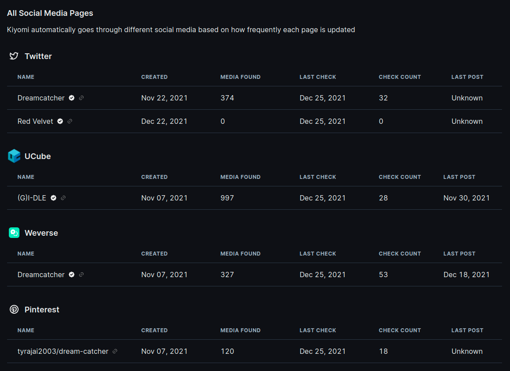
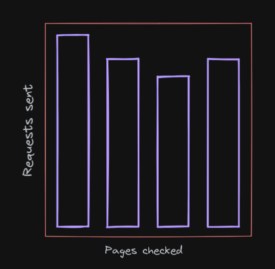
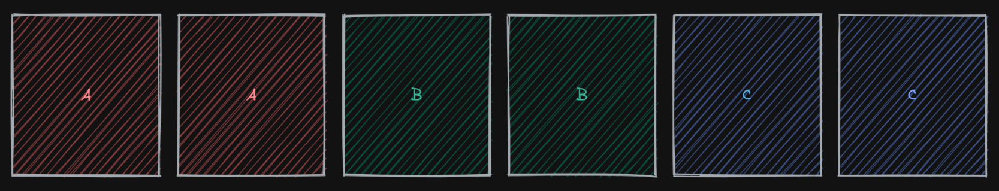
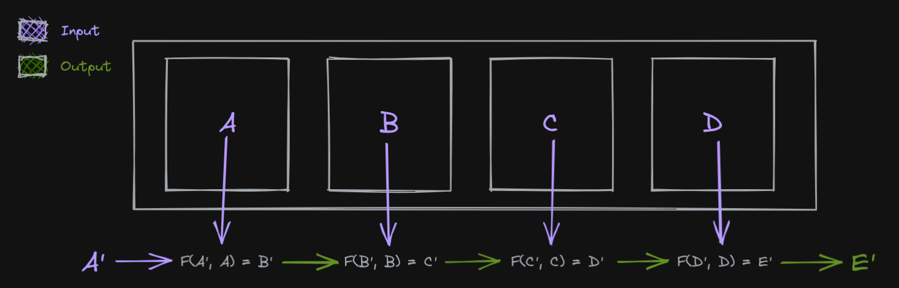

export const OGImage = () => {
  return (
    <Image
      sx={{ aspectRatio: "2" }}
      src={`https://opengraph.githubassets.com/1/Xetera/jiu`}
      borderRadius="md"
      width="full"
      mx="auto"
    />
  )
}

<Link href="https://github.com/xetera/jiu" target="_blank">
  <OGImage />
</Link>

<Hr my={8} mt={8} />

For the past year, I've been working on a website for Kpop image aggregation and labeling called <a href="https://kiyomi.io">Kiyomi</a>. I'm interested in imageboards like <a href="https://safebooru.org/" target="_blank" rel="noreferrer">Safebooru</a> that have an active community of fans who label every anime image to make searching easy for everyone. I love seeing how members come together to create a massive database of carefully curated content, and it's only possible because of how much diverse content there is for the community to go through. For that reason, one of the challenges in working on Kiyomi has been to make sure that I can get fresh content to users automatically. Thankfully, there's nothing Kpop idols love more than posting images of themselves online, so there's an endless source of relevant material to work with.

I decided to solve this with what I know best, a scraper that I named **Jiu** after one of the top 7 <a href="https://www.youtube.com/watch?v=PEKkdIT8JPM">Dreamcatcher</a> members. In case you're not familiar, scraping is a way of programmatically going to a website and extracting some kind of information from it. In my case, this information is image URLs and their associated metadata.

Normally this kind of image retrieval task is trivial to work with if all you need to check is a handful of pages on a single site. It's nothing more than a <T>for</T> loop, some database lookups, and a bunch of HTTP requests. But I was planning on scraping many websites, which meant the solution had to be easily extendable to support new sites. I also had to consider another thing, which is that I don't wanna like... be an asshole? I don't like it when devs carelessly hammer my website with requests. So given the nature of what I'm doing, it would be pretty hypocritical of me to try to do the same for others. This meant that while working on this service, I first had to exhaust all of the "good guy" workarounds before I moved on to less-friendly measures like rotating IPs and pretending to be a real user with puppeteer.

<Caption>Also, proxies that work well are expensive, and I'm cheap</Caption>

This project was originally meant to be a part of Kiyomi, but I figured the problem of finding images online was generic enough that it could be <Link href="https://github.com/xetera/jiu" target="_blank">its own standalone thing</Link>. Solving some of these problems has been incredibly fun and a huge learning process for me, so I'd like to document at least some of the ways I dealt with them.

## The problem space

This isn't crucial to understanding the problem, but I want to share the infrastructure Jiu sits on top of because it could provide important context. Also, I spent a lot of time working on this and drawing the diagram for it, so I'm going to need someone to look at it.

<WideMedia caption="Kiyomi architecture map">


</WideMedia>

New images Jiu finds on supported sites are stored in a database isolated from every other service and get published to RabbitMQ for consumers to do whatever with. Jiu also runs its own webserver to allow dynamically adding and removing new providers, querying the stats of scrapes, and displaying its schedule/history.



The requirements for building this scraper are:

- Creating a "plugin" system capable of supporting multiple social media sites
- Turning polling into an event-based system with webhooks/AMQP
- Automatically logging in to sites that require authentication
- Being able to handle failure from APIs gracefully
- Finding a high volume of images from different sites
- Being nice and not sending too many requests to any specific site (if possible)

<br />

## I am scraping respectfully

<Box
  as="img"
  mt={2}
  ml={4}
  mb={[4, null, "unset"]}
  float={["unset", null, "right"]}
  src="https://i.kym-cdn.com/photos/images/original/001/936/074/bb8.png"
  width="120px"
/>

The easiest way to prevent spamming a server with requests is to just not send it many requests, duh. This is an obvious one, but it's something that works surprisingly well for what we're building. Because the point of Jiu is to <Toastable color="green.400" text="eventually">It's pronounced "eventual consistency", not "wow this program is so slow wtf?"</Toastable> detect all images posted on social media and not as soon as possible. We can use this to our advantage when deciding the architecture of the scraper.

A common way of implementing these scrapers is something commonly referred to as a monitor. A monitor takes one or a handful of critical pages and bombards it with requests to detect a change as soon as possible.



This is useful for reacting to changes made in a website quickly, but it's not that important for this specific use case. Instead, the goal here is to detect changes across <T>every</T> social media account that posts about Kpop, but in a sustainable way (aka slowly). So we want the same volume of requests, just spread out thinner over time and across significantly more pages.


## Priority

Something important to recognize is that not all pages are created the same. There are accounts that consistently post good content, usually ran by companies behind groups; these should be checked frequently. There are also accounts that post infrequently, or post second-hand content (like with fan accounts); these should be checked less frequently. This requirement calls for implementing a priority system where different pages can automatically adjust their priority depending on the post frequency, on top of a manual multiplier if needed.

Originally, I went for a dynamic priority system where tasks would get re-scheduled based on how many images they found as they moved up and down on a discrete priority scale. The highest priority scrapes would get scheduled for 4 hours after a request, and the lowest would get two weeks. This worked well for changing scrape frequencies dynamically, but it created an issue with scrape distribution. It allowed multiple scheduled scrapes to fall within the same hour and get the bot rate limited by accident. This is unlikely with only a few endpoints but would become more and more likely as the app scaled, and that's a problem.

I played around with some numbers and re-scheduling details, but the problem here was scheduling itself. I had to completely re-think how I approached it. In the end, I went with something similar to a [token bucket](https://en.wikipedia.org/wiki/Token_bucket), often used for rate limiting algorithms. Every page/account has a bucket of tokens and a rate in which it gains new tokens (called <T>priority</T>). At the start of every day, their tokens get updated by their priority. If a page has more than one token, they get scheduled one scrape per token <T>sometime</T> within the next 24 hours, and that amount gets subtracted from their tokens.

At the start of the day, a database that looks like the following will get these tasks scheduled.

| Provider Type | Priority | Tokens |
| ------------- | -------- | ------ |
| A             | 1.0      | 2.0    |
| B             | 1.0      | 2.2    |
| C             | 0.5      | 2.5    |

<WideMedia caption="Example list of scheduled scrapes">



</WideMedia>

After every successful scrape, the next priority of the provider is calculated by getting the latest scrape result + the past 30 scrapes, and summing up the amount of images it found per check, weighed by how long ago the scrape was from the current day.

<WideMedia caption="Example list of scheduled scrapes">


</WideMedia>

This makes sure that an inactive account that starts to post images gets a higher bump in priority, and an active account that stops posting images gets knocked down an equivalent amount.

When the tokens for a provider is under 1.0, it gets compounded by its priority every day even if it doesn't get scraped. A priority can't go below 0.07 <Light>(meaning a scrape once every 2 weeks)</Light> and can't go above 1.75 <Light>(3 times every 2 days)</Light>.

## Distribution

Once all the tasks that need to run within the next 24 hours are identified, they need to be scheduled for an exact time with an even distribution. We can't just blindly start going through all pages that need to be sent requests immediately, otherwise we run into the exact same rate limiting problem from before.

That day's worth of pending requests need to be grouped by their provider type --think Instagram, Twitter, etc.-- and scheduled in an evenly-spaced manner using a linear interpolation between <T>NOW()</T> and <T>NOW() + 24 hours</T>


```css
/* scheduling algorithms be like */
.pending-requests {
  display: flex;
  justify-content: space-evenly;
}
```

This method of scheduling ensures that pages on different domains that don't share rate limits are processed concurrently, while pages that do share a rate limit get processed sequentially.

With what we know now, let's take another look at the scheduled tasks from last time and imagine each letter is an individual Twitter page, each scheduled to get processed at an even interval after the other.


<Caption>Can you spot the inefficiency here?</Caption>

We're scheduling the same page to be scraped multiple times right after each other. We're making sure to space the scrapes within the same provider evenly but leaving uneven spaces between repeated scrapes.

The correct order of the tasks should be more like this:


For this reason, Jiu tries its best to maximize the spacing between requests going to the same endpoint so that there's enough time for content to update.

"Tries its best" because sadly [the solution](https://stackoverflow.com/questions/12375831/algorithm-to-separate-items-of-the-same-type) to this problem is not simple or deterministic.

## Authentication

Another unfortunate problem that must be dealt with is that not every single website lets us view images without being logged in. To be able to do this, the login flow of the site needs to be [reverse engineered](https://gist.github.com/Xetera/aa59e84f3959a37c16a3309b5d9ab5a0) in order to grab the necessary images. This also sometimes comes with the downside of needing to fake a user agent (or possibly other fingerprints).

Now, I know that reverse engineering and using a private API for fetching data and going outside the boundaries of what a site thinks is acceptable kind of contradicts wanting to be nice to websites and not spamming them. But using official APIs can get us rate-limited quickly, even with large gaps in requests. I'm going out of my way to be careful with the sites I'm scraping, so I deserve this. Besides, I know what's best for Twitter more than Twitter knows what's best for herself, and I promise I will treat her like the queen she is if she just gives me a chance.

import NiceGuy from "./nice_guy.mp4"

<Box as="video" controls maxH="600px" margin="0 auto" mb={3}>
  <source src={NiceGuy} />
</Box>

<Caption>
  <Link href="https://vm.tiktok.com/ZM83u526w/" target="_blank" fontSize="14px">
    context
  </Link>
</Caption>

## Architecture and Code

For the more technical part, instead of copy-pasting functions from the codebase, I'm going to walk you through building a mini-scraper logic so you can maybe get a feel for what it would've been like to come up with some of the abstractions I haven't mentioned yet on your own.

I wrote this program in Rust, but I'm going to use Typescript examples because it's probably way more accessible for my audience. ~~Feel free to look at the Rust source if you're interested~~ In case you're interested, do not feel free to look through my Rust code. Please just keep reading the examples. I will take legal action against anyone I catch browsing through the repo.

Let's start with the most fundamental idea. A requirement for this project is that we need a solution that allows fetching different forms of media from many sites. One assumption we can make is that every image/video should conform to one shared interface no matter its source. At this point, one could go for a simple class that turns a URL into an array of images.

```ts
class Provider {
  constructor(public siteName: string) {}

  async scrape(url: string): Promise<Image[]> {
    const images = await this.request(url)
    return this.extractAllImages(images)
  }
}
```

<Caption>
  Try to use your imagination for the functions I haven't defined
</Caption>

We should now account for the possibility that this is the first time we're gathering data from that page and haven't seen any images. We need to add a pagination concept so our scraper can go through the page history and grab everything.

```ts {h:"3-16"}
class Provider {
  async scrape(url: string): Promise<Image[]> {
    let target = url
    const images: Image[] = []
    while (true) {
      const response = await this.request(target)
      const pagination = this.getPagination(response)
      images.push(this.extractAllImages(response))
      if (pagination.hasNextPage) {
        // turns ?page=1 into ?page=2
        target = this.getNextPage(target)
      } else {
        break
      }
    }
    return images
  }
}
```

Now we have a way of getting all images from a website. Except, with this approach, we always paginate through the full resource for every check. We should be able to stop when we find an image we've seen before and only "gather" the ones we haven't seen in a previous run. This can be solved by passing an array of previously seen images to the function to test against.

```ts {h:"8-14"}
class Provider {
  async scrape(url: string, seen: string[]): Promise<Image[]> {
    let target = url
    const images: Image[] = []
    while (true) {
      const response = await this.request(target)
      const pagination = this.getPagination(response)
      const found = this.extractAllImages(response)
      const unseen = this.allUnseenImages(found, seen)
      images.push(unseen)
      if (unseen.length !== found.length) {
        // some of the images we scraped were seen before
        break
      }
      if (pagination.hasNextPage) {
        // turns ?page=1 into ?page=2
        target = this.getNextPage(target)
      } else {
        break
      }
    }
    return images
  }
}
```

Great, it looks like this is working fine for one provider like Twitter, but it's still not scalable. The entire point of the project was to implement a solution that can have multiple sites plugged into it, and every provider is going to require a different way of fetching and processing data. There's a `Provider` class here, but it's not extensible in any way. We can't configure the parts that need to be swapped out for different sites because everything gets done in a single function. Perhaps OOP is the right fix? Maybe all we need to do is extend `Provider` and reuse the logic somehow.

```ts
class WeverseProvider extends Provider {
  override async scrape(url: string, seen: string[]): Promise<Image[]> {
    // ???
  }
}
```

But what exactly goes in this function now, literally everything we had in the previous class? Aside from `this.request`, every single method on here is custom (mostly) per-provider and can't just be overridden. It would be nice to have a way to almost... "template" a class method so that the `if` checks --like the part where we look to see if we've reached the end of everything we've scraped-- and `break` statements stay, but everything else is customized.

As you may have guessed, there's a way to do that. Well, not with templating, god no. That was a terrible call; what are you crazy? The issue is `Provider` is trying to do way too much here, and it's getting in our way. As a rule of thumb, when you run into a problem where you need to copy-paste <T>logic</T>, creating reusable functions is usually the correct approach. However, when you run into problems where you need to copy-paste <T>control flow</T>, the solution is getting rid of tight coupling.

I mean, why does this class need to care at all about previously seen images? A provider's scrape function only needs to scrape, and that's it, no? It's time to turn our single class method into a producer/consumer pair. Ideally, we need a producer that knows nothing about the outside world. And a consumer that only knows about the promise that a provider makes about what it's capable of doing through an interface.

Let's call the new class that will decouple that logic `Scraper`, and clean up the function names to reflect the new responsibilities of the two.

```ts
class Scraper {
  async scrape(provider: Provider, url: string): Promise<Image[]> {
    const seen = await this.getLatestResultsFor(provider)
    const found = await provider.process(url)
    return provider.allUnseenImages(found, seen)
  }
}

class Provider {
  async process(url: string): Promise<Image[]> {
    const response = await this.request(target)
    return this.extractAllImages(response)
  }
}
```

This works well for checking images. We can do something similar to re-implement pagination. Except, this time, the while loop can't be inside the provider; it has to be inside `Scraper`. The problem with that is the scraper doesn't understand what pagination means. Most sites (like Weverse) use page-based pagination, where you increase page numbers by 1 to go to the next page. But there are also sites (like Pinterest & Twitter) that use a cursor-based pagination technique, where you pass the server some opaque identifier from request one that represents the next page for request two.

`Scraper` shouldn't have to know anything about how a provider's pagination works, only that pagination is a thing that exists and needs to be passed back to a provider. `Provider` needs to accept and return information about pagination so it can decide what page to scrape by itself.

```ts
class Scraper {
  async scrape(provider: Provider, url: string): Promise<Image[]> {
    const seen = await this.getLatestResultsFor(provider)
    // undefined in the initial iteration
    let pagination: Pagination | undefined
    let images: Image[] = []
    while (true) {
      const result = await provider.process(url, pagination)
      const unseen = provider.allUnseenImages(found, seen)
      images.push(unseen)
      if (unseen.length !== result.images.length) {
        break
      }
      if (result.nextPage) {
        pagination = result.nextPage
      } else {
        break
      }
    }
    return images
  }
}

type Pagination =
  | { type: "cursor"; id: string }
  | { type: "page"; index: number }

type ProviderResult = { images: Image[]; nextPage?: Pagination }

class Provider {
  async process(url: string, pagination?: Pagination): Promise<ProviderResult> {
    const target = this.buildUrlWithPagination(url, pagination)
    const response = await this.request(target)
    const images = this.extractAllImages(response)
    const nextPage = this.extractNextPage(response)

    return { images, nextPage }
  }
}
```

import ImSorry from "./amogu.png"

This approach works perfectly! Though, the observant functional programmers <ChakraImage verticalAlign="baseline" alt="among us" display="inline-block" src={ImSorry} w="75px" /> may have noticed that the thing we're doing here looks awfully similar to <T>array.reduce</T>. We're going through a loop and feeding the result of a function call in one iteration (in our case, pagination) back into the function called in the next iteration, much like reduce. It could be useful to re-package iteration logic with a functional helper if it makes things easier to reason about.

As a refresher, `reduce` (also referred to as `fold` in some languages) works by doing something like the following, where it takes an <T>A'</T>, an array of values, and produces <T>E'</T> as an output.



export const Light = ({ children }) => (
  <Box as="span" color="text.400">
    {children}
  </Box>
)

But this doesn't quite work for us. We have an initial seed value of a URL, yes. But we don't have an array of things we can go over. Instead we want to <T>create</T> that array of things <Light>(image URLs)</Light> as a result of repeatedly applying a function <Light>(scrape)</Light> on something <Light>(pagination)</Light>. Almost like a fold, but the other way around. Thankfully the thing we're looking for here is a well-known concept like `fold` and is unsurprisingly called `unfold`.


We start with an initial value <T>A'</T> and produce two outputs, one as the value that will be "pushed" into an array and the other which will get passed as an argument into the next iteration.

```ts
class Scraper {
  scrape(provider: Provider, url: string): AsyncGenerator<Image[]> {
    // initial value is `undefined` beceause
    // the first scrape has no pagination
    return unfold(undefined, async pagination => {
      const result = await provider.process(url, pagination)
      if (result.nextPage) {
        return next(result.images, result.nextPage)
      } else {
        return stop(result.images)
      }
    })
  }
}
```

The hypothetical <T>stop</T> function here lets us signal the unfold to stop early if we've exhausted all resources. Typically, this would be done by returning an `Option` data type in a language like Rust, but it's hard to represent that as clearly in JS.

This approach to iteration lets us decouple logic even further. Unlike `fold` which reduces an iterable into a single value synchronously, `unfold` generates an array of values. If the operation that is being run to generate values is asynchronous, that array can also be represented as an <T>infinite stream</T> of values that a consumer can stop generating at any point. [Async iterators](https://developer.mozilla.org/en-US/docs/Web/JavaScript/Reference/Global_Objects/Symbol/asyncIterator) are great for doing this in Javascript.

```ts
const seen = await getLatestResultsFor(provider)
for await (const images of scraper.scrape(provider, url)) {
  const unseen = scraper.getUnseenImages(images, seen)
  if (unseen.length !== images.length) {
    // scraping stops here because the generator
    // is no longer being consumed
    break
  }
  await processImages(unseen)
  // delay the next iteration of the scrape
  // for 1 second
  await sleep(1000)
}
```

Since we're using generators now, the scraper doesn't need to know the conditions to look for to stop doing its job anymore; it stops when we tell it to stop inside the consumer (or runs out of pages). This means that if we wanted to, we could conveniently get the scraper to keep going even if it finds known images --like when re-fetching all images posted by a specific account-- without touching the scraping logic.

Error handling and other related things can also be done now by enriching the return value of `process` to include more information about what happened. A provider can accept an error _that it itself created in a different function_ and figure out how to deal with it without actually dealing with it to further decouple the process of handing off errors.

```ts
type ProcessResult =
  | { type: "success"; result: ProviderResult }
  | { type: "error"; response: Response }

type ErrorHandle =
  | { type: "tryAgain" }
  | { type: "tryAuth" }
  | { type: "cantContinue"; reason: Error }

async function iterate(pagination?: Pagination) {
  const process = await provider.process(url, pagination)
  if (process.error) {
    const decision: ErrorHandle = await provider.onError(process.response)
    switch (decision.type) {
      case "tryAgain":
        // retry logic with an unfold is nothing
        // more than recursion
        return iterate(pagination)
      case "tryAuth":
        await provider.authenticate()
        return iterate(pagination)
      case "cantContinue":
        // handle errors here :)
        return stop([])
    }
  }
  const { images, nextPage } = process.result
  if (nextPage) {
    return next(images, nextPage)
  } else {
    return stop(images)
  }
}

// inside scraper
return unfold(undefined, iterate)
```

Now, adding new providers is simple. It requires no duplication of control flow and not even a class. All that's needed is some object that satisfies an interface. Notice how even with a function like `onError`, we are simply taking a response as input and returning <T>a decision</T> as a response, not performing an action. This framework allows the gears of `Scraper` and `Provider` to turn together without stepping over each other's toes. Providers only know how to go, and scrapers only know how to tell providers to go.

```ts
interface Provider {
  process(url: string, pagination?: Pagination): Promise<ProviderResult>
  onError(response: Response): Promise<ErrorHandle>
  // any other functionality that could be customizable per site
}
```

<Hr my={6} />

I've skipped over how further implementation details of providers, persistence, publishing data, and other shenanigans work in Jiu in the interest of not boring people to death. But hopefully, this helps get a basic overview of implementing a generic scraper and decoupling business logic.

There are a couple more intriguing things I've come across while working on Kiyomi that I want to write about, like perceptual hashing and face recognition, but those will have to wait until I actually have any idea what I'm doing with them.

Here's <Link href="https://github.com/Xetera/jiu" target="_blank">Jiu</Link> if you're interested, and <Link href="https://kiyomi.io" target="_blank">Kiyomi</Link>.
