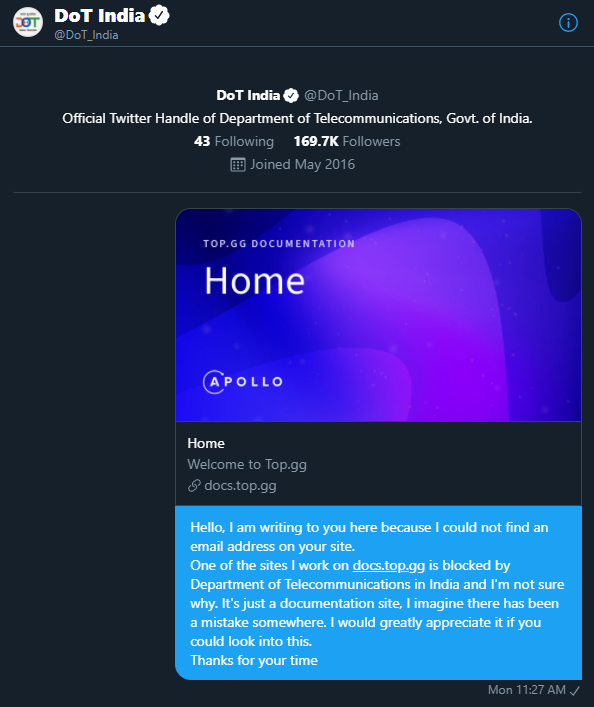

A few days ago I got a ping from one of the moderators in the Top.gg Discord server about something I've never seen happen before.

import Marco from "./marco.png"
import Drac from "./drac.png"

export const marcoProps = {
  username: "marco_rennmaus | Rennmoose2",
  roleColor: "red.300",
  avatar: Marco,
}

export const xetProps = {
  username: "Xetera",
  roleColor: "blue.300",
  avatar: Xetera,
}

export const dracProps = {
  username: "Drac",
  roleColor: "orange.500",
  avatar: Drac,
}

<DiscordMessageContainer mb={6}>
  <DiscordMessage
    messages={[
      <DiscordMessageText>
        Hey xet apparently{" "}
        <Link
          rel="external nofollower"
          target="_blank"
          href="https://docs.top.gg"
        >
          https://docs.top.gg
        </Link>{" "}
        is banned in India?
      </DiscordMessageText>,
      "might wanna check this one out",
      "one of the users is having problems with it",
    ]}
    date="like probably 5 minutes ago"
    {...marcoProps}
  />
</DiscordMessageContainer>

I'm sorry? Why would a documentation site get banned by the Indian government? Surely this is a mistake. Anyways, best to check it out to see what's going on.

import ProofXet from "./proof-xet.png"
import ProofOriginal from "./proof-original.png"
import MaverickWolf from "./maverick-wolf.png"

<DiscordMessageContainer mb={6}>
  <DiscordMessage
    messages={[
      <ChakraImage src={ProofOriginal} mb={2} />,
      "any reason why?",
      "you have some expired license for that URL or something?",
    ]}
    username="Maverick Wolf"
    roleColor="green.300"
    date="06/28/2021"
    avatar={MaverickWolf}
  />
  <DiscordMessage
    messages={[
      "lemme check with a VPN",
      "huh, weird",
      <ChakraImage src={ProofXet} mb={2} />,
      "could be getting caught in a wide net cast on some subdomains",
    ]}
    date="06/28/2021"
    {...xetProps}
  />
  <DiscordMessage
    messages={["well uhm", "how to fix kekw"]}
    date="06/28/2021"
    {...marcoProps}
  />
  <DiscordMessage
    messages={[
      "apparently some indian isps briefly banned google docs in 2014",
      "could be some sort of clash with that?",
      "docs.google.com, docs.top.gg",
    ]}
    date="06/28/2021"
    {...xetProps}
  />
</DiscordMessageContainer>

Ok, this is a strange situation but the google docs ban seems like a fairly reasonable lead to follow.

After a little bit of digging around on Google I found out that Google sites were never blocked to begin with.

> In an order dated 23 June 2014, the Delhi High Court upon a request made by Sony Entertainment ordered 472 file sharing and file hosting websites blocked, including The Pirate Bay, Google Docs, Google Videos, and Google's URL shorterner (goo.gl) [...] However, it was reported on 7 July 2014 that an updated court order blocks just 219 sites. Included are many file storage and torrent websites, **but no Google sites.**

So I guess that's not it then. Time to start looking somewhere else. Should I just be getting in touch with the Department of Telecommunications at this point? I know plenty of Indian developers in different communities I hang out in, maybe they can help me figure out what's going on.

I'm also not convinced this is a global ban. Sure, a documentation site doesn't receive that much traffic but we have a lot of Indian users and someone would've either let us know about this ban a long time ago, or there would be more than one person with the same problem, right? It seems very odd that I'm only now hearing about this and only from a single user.

Let's check in with people in a different server.

import WindowsUser from "./windows-user.png"
import Sky from "./sky-avatar.png"

export const windowsUserProps = {
  username: "windows user",
  avatar: WindowsUser,
}

export const skyProps = {
  username: "Sky",
  avatar: Sky,
  roleColor: "teal.400",
}

<DiscordMessageContainer mb={6}>
  <DiscordMessage
    messages={[
      "does anyone know how I can get in touch with department of telecommunications in india lol",
    ]}
    {...xetProps}
    date="06/28/2021"
  />
  <DiscordMessage
    messages={["any reason for that?"]}
    date="06/28/2021"
    {...windowsUserProps}
  />
  <DiscordMessage
    messages={[
      "one of the sites I work on is blocked by them and my indian users can't access the site",
      "it's literally just api documentation. I have no idea why it would be blocked",
    ]}
    {...xetProps}
    date="06/28/2021"
  />
  <DiscordMessage
    messages={[
      "That's the Indian government for you",
      "You can always try writing an email to them",
    ]}
    date="06/28/2021"
    {...windowsUserProps}
  />
</DiscordMessageContainer>

That _would_ be nice but I don't think they want me, or really anyone emailing them, ever.

At least I can definitely relate to not wanting emails.

Oh they do have their twitter page up there though. Seems a bit silly but I know my mom managed to figure out some problems with Cox in the US only after DMing them on Twitter so maybe that'll work for me here too.

<Text fontSize="sm" mb={6} textAlign="center" layerStyle="textTertiary">
  Please ignore the fact that I yoinked the docs page from the{" "}
  <Link
    target="_blank"
    href="https://www.apollographql.com/docs/"
    rel="nofollower noopener"
  >
    apollo docs
  </Link>
  .
</Text>

I know I don't have a ton of experience sliding into DMs but I was really hoping the government of India of all people wouldn't leave me on read.

They also have an option to leave feedback on their site. I could try sending the same message there.

Welp, that went about as well as I thought it would. I figured this might've been because of my non-indian IP but sadly it didn't work with a VPN either. I dug around in dev tools and it's something about my captcha being invalid...? I can't even be bothered tbh.

It's 10 AM at this point and I don't exactly feel like making an international call inquiring the status of my national ban. Also, I hate phone calls, please don't call me. It might be a good idea to check if anyone else is having problems reaching the site. That should help narrow things down a bit.

import ProofSky from "./proof-sky.png"

<DiscordMessageContainer>
  <DiscordMessage
    messages={[
      "Can someone help me figure out why the Department of Telecommunications banned my site.",
      <DiscordMessageText>
        <Link
          rel="external nofollower"
          target="_blank"
          href="https://docs.top.gg"
        >
          https://docs.top.gg
        </Link>{" "}
        if any of you are in India and want to check for me
      </DiscordMessageText>,
    ]}
    date="06/28/2021"
    {...xetProps}
  />
  <DiscordMessage
    messages={["sigh", <ChakraImage src={ProofSky} mb={2} />]}
    date="06/28/2021"
    {...skyProps}
  />
  <DiscordMessage
    messages={["Working for me"]}
    date="06/28/2021"
    {...windowsUserProps}
  />
  <DiscordMessage
    messages={["I'm in kolkata, india", "using jio as ISP"]}
    date="06/28/2021"
    {...skyProps}
  />
  <DiscordMessage
    messages={["I'm in noida"]}
    date="06/28/2021"
    {...windowsUserProps}
  />
  <DiscordMessage
    messages={["Are you using your ISP's DNS though?"]}
    date="06/28/2021"
    {...xetProps}
  />
  <DiscordMessage
    messages={["Oh right, it works with cloudflare DNS"]}
    date="06/28/2021"
    {...skyProps}
  />
  <DiscordMessage
    messages={["Works for me", "(im in india)"]}
    date="06/28/2021"
    {...dracProps}
  />
  <DiscordMessage
    messages={["probably because you aren't using your isp's dns"]}
    date="06/28/2021"
    {...skyProps}
  />
  <DiscordMessage
    messages={["it's either that or some ISPs don't enforce the ban"]}
    date="06/28/2021"
    {...xetProps}
  />
  <DiscordMessage
    messages={["It's working even on my phone"]}
    date="06/28/2021"
    {...windowsUserProps}
  />
</DiscordMessageContainer>

Oh so it's a DNS issue then. Looks like it's banned at the DNS level for Indian citizens. But windows user (if he doesn't unknowingly have a custom DNS setup) is able to reach the site through his ISP's DNS. Maybe different Indian ISPs enforce censorship at different levels?

I know this is something Turkish ISPs do extremely inconsistently as well. Plenty of VPN sites like NordVPN are banned by ISPs that have close ties to the state but others don't seem to be bothered to enforce certain bans. At least I haven't had any problems connecting to VPNs with the god-awful network provider I'm currently using, and yet my parents have. I could totally see this being the case for India as well.

<DiscordMessageContainer>
  <DiscordMessage
    messages={["what isp are you all using"]}
    date="06/28/2021"
    {...xetProps}
  />
  <DiscordMessage messages={["Jio"]} date="06/28/2021" {...windowsUserProps} />
  <DiscordMessage
    messages={["I'm on airtel"]}
    date="06/28/2021"
    {...dracProps}
  />
  <DiscordMessage messages={["jio here too"]} date="06/28/2021" {...skyProps} />
</DiscordMessageContainer>

Great, so we have two people using Jio, one of whom can view the site and another person who can't. Could the ban be enforced geographically? That's not unheard of but it feels like the explanations we're reaching for here are starting to get more far-fetched every time.

At this point I take a break from the intense investigative journalism to go back to doing what I was supposed to be doing for half an hour or so.

I come back and have the idea of looking at the traceroute for the URL to see what IP the docs URL is being resolved to when I'm on an Indian VPN. But to my surprise I see...

<Text
  textAlign="center"
  fontWeight="black"
  mb={6}
  layerStyle="textPrimary"
  letterSpacing="12px"
  fontSize={["2xl", null, "3xl", "4xl", null, "6xl"]}
>
  WHAT???
</Text>

Why is it working now? Maybe it's just a VPN thing?

<DiscordMessageContainer>
  <DiscordMessage
    messages={[
      <DiscordMessageText>
        <DiscordMention>@Sky</DiscordMention>
        could you check on the first device that was blocked if you're still free?
        I feel like it's just working now for no reason
      </DiscordMessageText>,
    ]}
    date="06/28/2021"
    {...xetProps}
  />
  <DiscordMessage
    message="k let me reset my dns back to how it was then"
    date="06/28/2021"
    {...skyProps}
  />
  <DiscordMessage message="ur the best" date="06/28/2021" {...xetProps} />
  <DiscordMessage
    messages={["um, it works now?", "how"]}
    date="06/28/2021"
    {...skyProps}
  />
  <DiscordMessage
    messages={["this is so weird", "I hate this so much"]}
    date="06/28/2021"
    {...xetProps}
  />
</DiscordMessageContainer>

<Text textAlign="center" mb={6}>
  Why do these things always happen to me?
</Text>

<Text textAlign="center" mb={6} fontSize="sm">
  I hate web development
</Text>

export const CloudflareDns = () => (
  <Link href="https://1.1.1.1" rel="noopener noreferrer" target="_blank">
    1.1.1.1
  </Link>
)

To be fair, it's possible (and most likely the real reason in this specific case) that it works now because the DNS query got cached at the router and/or browser level when Sky switched his DNS server to <CloudflareDns /> and got a successful response. But I've seen the same thing happen to at least 3 people where they inexplicably regain access to the site after a while, even when they haven't switched their DNS server.

## Possible explanation

What I _think_ is going on here is that some Indian ISPs (most likely Jio in this case) are using some sort of heuristic to determine whether or not a DNS query to a site should be blocked, and then they are **caching** the result in their own DNS servers to speed up subsequent lookups.

This is completely normal practice for DNS servers, but unfortunately it feels like they might be committing the cardinal sin of caching. Where they leave out part of the context that changes the response per-user, and are instead using a single shared cache key for every user when doing any lookup. On the user side of things, this is equivalent to opening up Instagram and seeing the feed of a different person every 30 minutes.

Chances are, the DNS query was cached when the original person who tried to reach the docs page got an error. Any subsequent requests going to the same DNS server ended up returning the same cached error response for as long as the TTL lasted. Then when the cache got reset, it got replaced with the correct IP originating from the request of a non-blocked user. Which allowed the original blocked user to also be able to access the site.

As for the reason for the censor itself, I'm still not sure but my team and I are speculating that it's caused by an [old censorship of GitHub](https://en.wikipedia.org/wiki/Censorship_of_GitHub#India). Our docs page was being hosted on GitHub Pages and the ban is mostly likely the result of a lingering censorship of the GitHub Pages IPs. We've since moved to [Netlify](https://netlify.com) and it seems that solved the issue. Or at the very least I haven't seen anyone bring this up since then.

## Solution

If you're being affected by this, the easiest solution is to change your DNS server your device or preferably your router uses to <CloudflareDns /> or any other public DNS server that isn't limited by Indian censorship. You do **not** need a VPN as it doesn't seem like the DoT uses packet inspection and relies only on DNS lookups. If you're using GitHub Pages to host your site, switch over to an alternative like [Cloudflare Pages](https://pages.cloudflare.com/) or [Netlify](https://netlify.com) to make sure you don't run into the ~~great~~ mediocre firewall of India.
