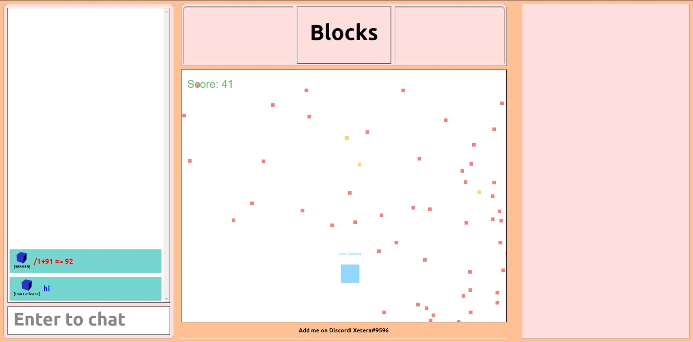

You're a 19 year old highschool graduate, unsafisfied with life and with no desire to do anything, partially because you don't know what's out there, but also because you see that you get bored of everything you've tried to learn in the past. You feel like you're a curious person but not a hardworker because you've never seen yourself succeed in things other people work hard to get better at, especially not school. The one thing you _do_ love is gaming but you're not even successful at that despite pouring hundreds, no.. _thousands_ of hours into it. Knowing this about yourself, you think "maybe I'm just bad at learning", and proceed to log back into World of Warcraft for the millionth time to forget about your problems.


> Future in shambles but that loadout popping off though

6 months after starting a chemistry degree you realize you hate it and drop out, losing any little certainty you had about the future of your life. Chemistry was your strongest subject so now you're left with absolutely nothing else to do. You eventually decide that you're going to sign up for a computer science degree and you come to this brilliant conclusion by remembering that you've tried programming 3 times before and hated it every time but maybe it'll be ok because you like playing games on the computer and programming is also done on the computer...? Not the smartest choice you've made, but a choice nonetheless.

Fast forward a week or so, and you've decided that you might as well get started and look up some programming stuff and you remember hearing that python is a good beginners language, so you figure you might as well get started with it. You pick up Zed Shaw's awful [Learn Python the Hard Way](https://learnpythonthehardway.org/python3/) and start reading through a fairly bland book.

```py
print("Hello World")
```

<br />

Cool, you wrote your first line of code but it wasn't all that impressive and you get bored about an hour in, but this is a kind of boredom you haven't felt before. You don't feel an urge to close the tab and start a new game of League, you want to keep writing code. It is here that you do something _unspeakable_, something so outrageous that it makes all highschool teachers and college professors around the world turn in their metaphorical graves. You decide to skip ahead and do something more interesting instead of continuing to learn the basics. This isn't how you're supposed to do things, maybe you're just bad at learning.


A day or two go by and after making a coinflip and number guessing game you're bored once again even though working on them was enjoyable. You've recently been spending a lot of time on Discord and realized that the music bot you've been running with your friends is written in Python! You go through the source code to see how it works and by some miracle you somehow figure out how to add a new command. It's not pretty, and [definitely cursed](https://gist.github.com/Xetera/522a615bc065fbe37490527c7bc3f679) but you managed to use your 3 day programming knowledge to make something happen. Your friends don't seem to care too much but it doesn't even matter, you're satisfied after you managed to get a language you barely know working with an API you've never used before. Wanting to do even more exciting things, you continue to write code but constantly hit road blocks, you eventually decide to ask for help but the people end up telling you you suck and need to learn how to program... maybe you're just bad at learning.

But you've found something you find fun! So you keep going and eventually writing code becomes so enjoyable that you no longer have urges to play games all day, or even at all. Your desire to keep writing discord bots forces you to look up a bunch of things you didn't know, you end up learning about promises, how to use a database, you finally understand how websites work and even attempt making one yourself to add a game in it.



But it sucks and you're not happy with it and you know nobody else would be either. As if making games isn't hard enough, you're frustrated that your hard-earned programming knowledge isn't helping you make your websites look half-decent. You keep up the hard work but every new design is a disaster more terrifying than the last and you're not making any progress, maybe you're just bad at learning.

A year passes and despite having a bunch of projects under your belt you look back and see that almost all of them are unfinished and abandoned projects you either gave up on or got bored of but at least you're getting the hang of things now and continue working on things that excite you like you've been doing since day 1. Eventually you get around to learning things like React, Angular, Vue, MongoDB, your curiousity for programming spreads beyond your initial goal of web development and you find yourself looking up the documentation for different popular languages like C++ or Java but also more obscure stuff like Haskell, Purescript or Elm just because the way it works blew your mind and no other reason.

```hs
spongebobCase :: String -> String
spongebobCase = zipWith ($) (cycle [toLower, toUpper])
-- spongebobCase "memes" => "mEmEs"
```

<br />

Math, a thing you once swore to never touch unless your life depended on it, suddenly became more interesting because of something you didn't even know qualifies as math. You even started to earn money doing something you love and all this time you've been begrudgingly attending school, skipping classes (even computer science classes) to continue working on your projects. You finally take a step back and look at the progress you've made, you feel as if you're capable of doing so much more than you ever thought you could be, and you think about the time you felt like an idiot in highschool for not being able to keep up in classes. How you weren't able to get anywhere with things your parents and teachers kept telling you were important and you realize maybe you're not bad at learning, maybe they're bad at teaching...

But it only takes one to tango.
