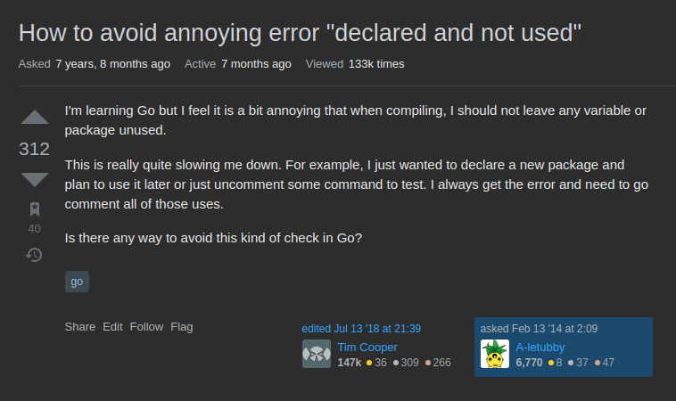

A month or two ago, I put an image of a tierlist of languages that I like using in my Github readme, ranked from F to S tier. F being my least favorite, and S being my favorite. It looked something like this:


- **(S)** Rust, Haskell
- **(A)** Kotlin, Elixir, F#
- **(B)** Scala, Typescript, Dart, C#
- **(C)** Java, Ocaml, Python, Javascript, C++, Ruby
- **(D)** PHP, Coffeescript, Powershell, Lua, Clojure
- **(F)** Go

<br />

Part of me obviously just wanted to put that up to get reactions out of people. It's a little bit nonsensical to try to rank programming languages in a tierlist. I'm not sure what you'd have to be looking for to compare a language like Dart with Powershell. The whole thing was mostly for fun.

I had opinions on a few more languages, but the tierlist I was using didn't have them. Maybe I'll make my own website for ranking programming languages at some point.

export const Gopher = () => (
  <Toastable text="Gophers" color="blue.300">
    Name given to the people in the Go community
  </Toastable>
)

Anyways, a bunch of people were upset over how I placed their favorite languages in the C tier. Some people were surprised to see their choice at the top, but <Gopher /> were <T>FURIOUS</T> that their favorite language was the only one at F tier.

What do I have against Go? Do I hate their cute mascot that much or is it something else?

## Correctness

I don't know about everyone else, but I am a pretty bad programmer. I often make silly mistakes in my code or skip important things in code review that I should be catching. I'm confident in my skills, but if you put me in a room and tell me my code has to work as intended in my first attempt without any checks to save my life, I will probably give up immediately and call my parents to tell them I love them instead.


I want a compiler to have my back. We humans suck when it comes to keeping complex conditions and details in our heads, but computers are basically designed to be good at that. I want a computer to tell me when I'm making a mistake at the time of writing the code. Hell, I wish the computer could just write the code for me to begin with. At the end of the day, I just don't want to hope that every single person I'm working with is just a God developer who can catch every mistake before changes are pushed to production because that just doesn't ever happen.

import openYourEyes from "./null_pointer.mp4"

<Box
  borderRadius="md"
  as="video"
  width="100%"
  src={openYourEyes}
  muted
  playsinline
  controls
  muted=""
  mb={6}
/>

Golang claims to be a proponent of this too, and it shows that by enforcing one of the most annoying linter warnings of all time in the form of an error directly inside the compiler.



After all, if you have unused variables in your code, chances are you might have done something wrong. It doesn't make a whole lot of sense to declare a variable and not use it. This is a perfectly reasonable argument to make.

Unfortunately, if you're used to commenting things out when developing, this is going to force you to jump through a bunch of hoops and have somewhat of a clown moment in your codebase just to test stuff out.


Aside from being <T>unbelievably annoying</T>, workarounds like these arguably become a bigger vector for bugs in your code than leaving things unused or having linter warnings. As a developer, you've now added a hack into your code to solve this issue but are still implicitly relying on the compiler to let you know when things are unused. When you make changes later on, and that variable turns from a simple unused variable into a legitimate bug, you feel confident in the correctness of a program that is no longer being enforced by anything in that specific instance.

Overall, this is an understandable check to have in a language that is truly concerned with correctness. If your language believes it should be as difficult as possible for a developer to add bugs in their programs, making life difficult in ways that feel unnecessary is just one of the Ls that developers have to take for extra safety. Even when that involves the language making controversial decisions or disrupting devs development cycles.

The only problem is, Go doesn't seem to be interested in safety or correctness at all. It wholeheartedly embraces null pointer exceptions --which is by far the most common source of bugs in any program-- by creating an error handling system where dynamic values can be null at any time with no compiler checks involved. You simply have to remember not to create bugs and to check errors before dealing with error-able values. Quite a different philosophy from the one Go's unused variable check would like to have you believe it adopts.

```go
func thing() {
  result, err := doThing()
  // is result nil or defined? Dunno but hope you don't forget to check
  print(result.someField)
  // panic: runtime error: invalid memory address or nil pointer dereference
}
```

This is in contrast to a language like Rust, which won't let you shoot yourself in the foot with any value that may be an error or undefined.

```rust
fn thing() {
  let result = do_thing();
  println!(result.some_field);
  // error[E0609]: no field `some_field` on type `Option<Thing>`
}
```

Not to mention, for the amount of emphasis being put on concurrency, Go also doesn't address the inherent problems that come with concurrency other than by the design of the language itself (channels as a means of communication between goroutines and such). Rust does a good job in comparison by preventing things like data races and memory safety issues because that's consistently been an important part of the language and doesn't get sidelined in favor of things like easy adoptability.

The lack of these kinds of features isn't always a problem for me. Safety and static typing are really important but not necessarily a dealbreaker for my taste. I like Elixir enough to put it in A tier (whatever that means at this point) which is a dynamically typed language, mind you. And much like Go, Elixir also does not concern itself with preventing the user from adding bugs in their code too much. But the difference is, unlike Go, Elixir embraces the fact that it can't ensure there will never be problems. It doesn't pretend to care about correctness to the point of adding ridiculous compiler checks in ways that don't add any safety. Instead, it has built-in mechanisms to recover from failure as intelligently as possible as a part of the language, and decides to face that reality instead of pretending it doesn't exist.

Of course, caring about safety in a language isn't just a binary choice of "this language is safe" and "this language isn't". It's just that Go's priorities when it comes to correctness and safety seem very misguided, and from what I understand, just an afterthought compared to things that I consider to be much less important like adoptability or ease of use.

## Simplicity

The reasoning behind this archaic error checking method and the unused variable thing is that Go wants to be as simple as possible. One way to ensure that simplicity is by only allowing a single "Go way" of doing things. Every engineer working with the codebase should be able to hit a problem with a Go-shaped hammer and get a predictable Go-shaped solution out of it. If you're not allowed to handle errors in any way other than always explicitly passing it back to the caller, for example, there's no debate to be had about how error handling should be done.

This is not a bad thing to strive for, but the way Go approaches it is a little... well, I'll just let you decide how you feel about this quote from Rob Pike, one of the creators of the language.

> The key point here is our programmers are Googlers, they’re not researchers. They’re typically, fairly young, fresh out of school, probably learned Java, maybe learned C or C++, probably learned Python. They’re not capable of understanding a brilliant language but we want to use them to build good software. So, the language that we give them has to be easy for them to understand and easy to adopt.

Go doesn't necessarily only want to make your life easier by preventing arguments about menial things the way something like Angular for javascript approaches opinions. It straight up doesn't think you're capable of dealing with the tools you think you should have. Why don't we have generics in the language? Because generics are hard and you just graduated from college last year.

Maybe I'm just being weird here but I don't really want to use a language built by people who think they're better than me...? Like, don't get me wrong, almost everyone working on Go certainly is. I just don't think this is a healthy way of building a relationship with a community, though that might just be the brash nature of Rob Pike in specific.

This kind of makes sense in a way when you think about it, because Go was never built for a community; it was built for Googlers. It only ended up taking off with the rest of the programming community due to being open source and its amazing approach to concurrency, which was the main problem they were trying to solve at the time. But because it was never built for a community, it has all of this baggage that makes sense in the context of a company imposing restrictions on its employees with what they believe to be the correct approach, but not in the context of an open language for everyone to use.

Another important issue is Go's philosophy seems to hint that complexity only comes in the form of complex abstractions. That if you are not given complex tools like union types, generics, or macros, your programs will necessarily be simpler. And this to me seems like a child's way of thinking about how complexity arises in programs. Simplicity is not a linear scale of small and big. It's a delicate balance across many things in multiple dimensions. Sure, having too many tools and too many ways of doing the same thing is going to cause complexity like it does with a language like C++, but so will having no tools to deal with complex issues. After all, you can't be expected to chop down a tree with a steak knife. When your go-to abstraction for generalizing solutions is copy paste, that extra effort you had to spend learning and understanding new abstractions is now going to be used to maintain code that was written with a steak knife; making understanding a solution built with simple ideas much more difficult than it has to be.

You'd much rather have access to more complex concepts to represent more complex problems in those situations, because complexity isn't inherently bad. Maybe you don't want to have to understand what the hell a <T>Semigroup</T> is to add 2 lists together, but you also don't want to have to copy paste

```go
if err != nil {
  return nil, err
}
```

13 times in the same function and then copy paste that function N times for all data types only to solve an otherwise-trivial problem.

Overall, Go is not built by inexperienced people or even a bad language depending on what you value. It makes a lot of opinionated choices and deliberate compromises of important abstractions to solve problems that I don't consider to be worthwhile at all. The concurrency is awesome, but the pain of actually using the rest of the language simply does not justify it.

Honestly, just use Rust.
