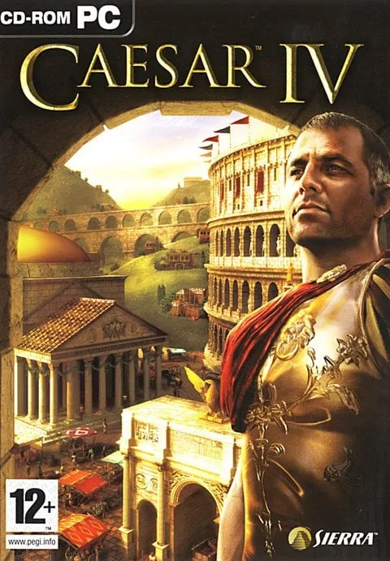
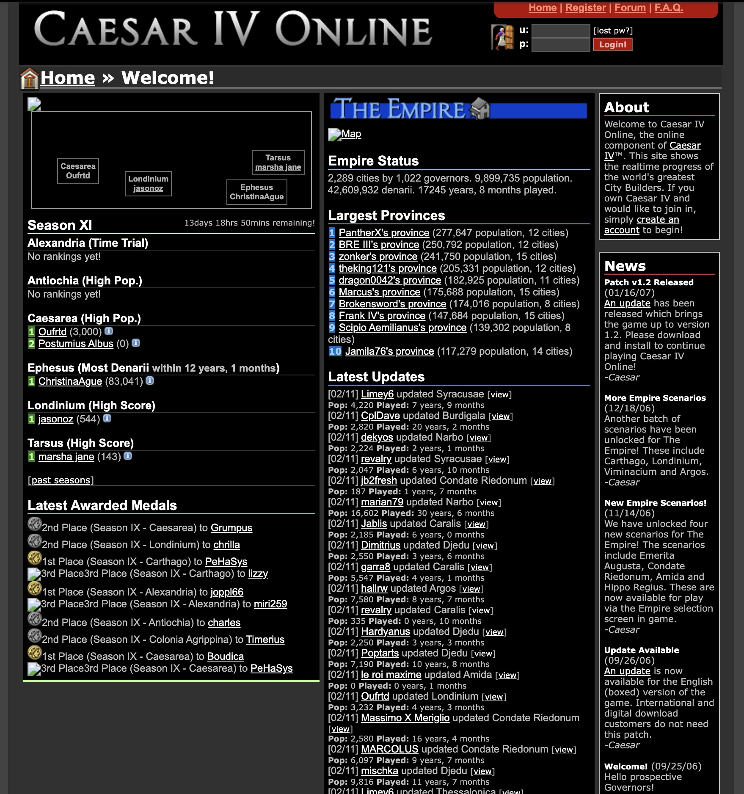
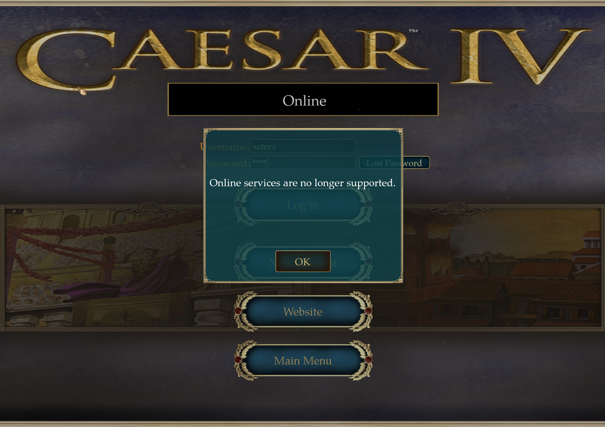
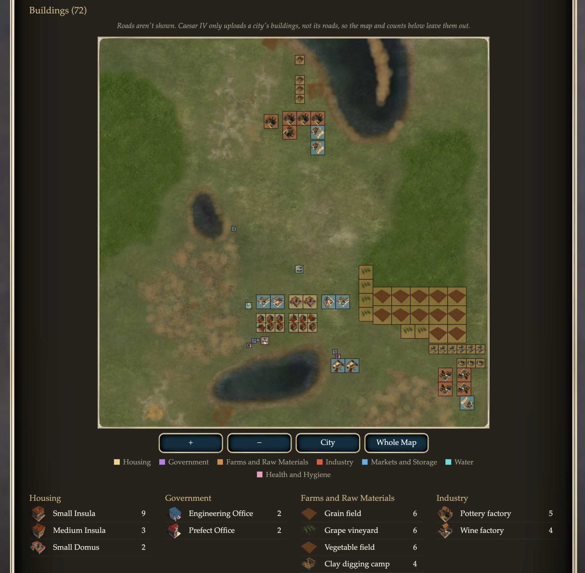
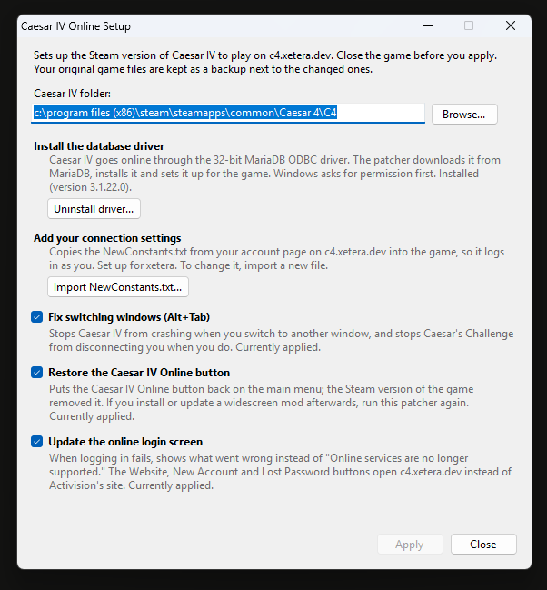

import T from "🧱/T.astro";
import Callout from "🧱/article/Callout.astro";
import ExternalLink from "🧱/ExternalLink.astro";
import Caption from "🧱/Caption.astro";
import WideMedia from "🧱/article/WideMedia.astro";
import WidePicture from "🧱/article/WidePicture.astro";

<Callout title="TLDR">
  <span>You can now play Caesar IV online again by going to </span>
  <span>
    {
      <ExternalLink
        target="_blank"
        referrer
        class="text-blue-400 underline"
        href="https://c4.xetera.dev/?utm_source=blog"
      >
        https://c4.xetera.dev
      </ExternalLink>
    }
  </span>
  <span> and following instructions to create a new account.</span>
</Callout>

As a kid, I loved playing games with a burning passion, and one of my favorites was this 2006 city builder called <T>Caesar IV</T>.



If that name rings a bell, you're likely thinking of the third game, Caesar III, which is by far the most popular installment with an infamous open source recreation called [Julius](https://github.com/bvschaik/julius)† you should check out. Sadly that one was a bit before my time (and not as good in my controversial opinion). Caesar IV lets you build gorgeous 3D cities, where you manage trade and supply chains, build an army and keep your people as well as Caesar happy as he keeps requesting you to send him resources.

import city from "./example.jpg";

<WideMedia>
  <WidePicture
    alt="Example of a bustling city in Caesar IV"
    src={city}
    aspectRatio="1658:805"
  />
</WideMedia>

I remember the first time I moved to Bulgaria with my dad in 2008. The house was freezing cold because the boiler wasn't working yet, it was well past midnight and I was exhausted from the 8-hour car trip. But I knew I had to hop on my dad's computer and open up my last save game even for just a few minutes before I got scolded for not changing and going to bed. It was totally worth it. Sorry for being a pain in the ass, dad.

The entire time I spent playing this game, I'd wondered what playing online would be like. When I tried pressing the <T>New Account</T> button, the website never loaded. This was right around the time Activision Blizzard's acquisition of Sierra's parent company, Vivendi Games, was being finalized and their online servers were getting shut down, which affected Caesar IV too. The thing is, all my games were pirated anyway. So even if the servers were still up by then, it wouldn't have made a difference. I used to play Age of Empires 3 with my dad over LAN back then (I know, I'm always one release late to these games), so I was really hoping I could play this with him too. Sadly that never happened.

import onlineLogin from "./online.png";

<WidePicture alt="example of bad distribution" src={onlineLogin} />

Looking back at it now, it's basically impossible to find any footage of what playing online was even like. Nobody has uploaded any of it on YouTube other than one guy looking at the login asking exactly what I was asking, and there are no pictures of it on Google Images or any forum I can find today either. Well, 18 years later, I now have the answer. And little Ali would be heartbroken to learn what's behind that login screen.

# Restoring Online Play

<Callout title="Full Disclosure">
  The majority of this research was done with Claude Code. This entire project
  from start to finish took me 2 days when it should've really taken 2 weeks.
</Callout>

Digging through the game's settings and code to see how the multiplayer server works, something completely unexpected jumps out at me in the config file `NewConstants.txt`.

```txt
Network/Database/SQL/c4id;string;select lastactive, username from users where c4id=%i
Network/Database/SQL/CheckC4ID;string;select c4now(), username, lastactive from users where c4id=%i
```

The game makes raw SQL queries! Not the multiplayer server, to be clear, the game client itself. After looking through the decompiled code, it's clear there's actually no multiplayer server at all. It was all just an online leaderboard people could post their scores on by adding rows to a database directly from the client... terrifying. The Steam release replaces that link with `activision.com`, but I was able to find the original link by going through the Caesar 4 Heaven <ExternalLink href="https://caesar4.heavengames.com/archives/december-2007/">archived news posts from 2007</ExternalLink>. Plugging that into the [Wayback Machine](https://web.archive.org/web/20260000000000*/http://caesarivonline.com), we can see there was a website dating back to 2006 that was, uh, no doubt made in 2006.



To log in, the game specifically looks for the 32-bit MySQL 3.51 ODBC connector, but doesn't even redistribute it in the game files. I hope this is just because the Steam release doesn't include online play related code, and not because they wanted gamers to manually install it. Regardless, for restoring online play, this is something you're going to have to do because you almost certainly don't have this 32-bit driver installed on your Windows 11 machine. Speaking of missing online features, the Steam release also starts with the online play option missing entirely.

import mainMenu from "./main_menu.jpeg";

<WidePicture
  alt="Main menu of Caesar IV, with the online play button missing"
  src={mainMenu}
  aspectRatio="21:11"
/>

{<Caption>There's supposed to be a "Caesar IV Online" button in there...</Caption>}

Cleverly, the game loads almost all UI elements from `.dat` files in the installation directory, which were modified for Steam to not include the Online button at all. By tinkering with the file format, we can figure out how to add it back, as all the menus are still in the game. It's just the buttons that are missing. Though this is yet another extra step required to re-enable online play.

The next step is to run an ancient MySQL (or MariaDB in my case) database for the game to connect to. This step is easy to prototype since the queries the game makes are already all out in the open. I just had to get a clanker to create the db schema based on the queries. If anything does go wrong in this process, you get very unhelpful error messages.



Thankfully, these are also templated by an XML file you can edit to restore helpful error messages. Logging in isn't really logging in, as you can imagine. The game selects your account (as opposed to someone else's account, which it could totally do) based on your registration data on `caesarivonline.com` at the time, then hashes your password with your CD key to compare against what it got from the db alongside an `activated` field to see if you're banned. All of this is client driven.

With the database returning the right hash for the game to compare against, and a seed of the scenarios we want the leaderboard to contain, we finally see what's behind that online screen. Drum roll please!

import behindOnline from "./behind_online.png";
import caesarsChallenge from "./caesars_challenge.png";

<WideMedia contain>
  <div class="flex flex-col sm:flex-row gap-2 w-full">
    <div class="min-w-0 flex-1">
      <WidePicture
        alt="The Caesar IV Online screen after logging in"
        src={behindOnline}
        aspectRatio="1930:1440"
      />
    </div>
    <div class="min-w-0 flex-1">
      <WidePicture
        alt="The Caesar's Challenge screen"
        src={caesarsChallenge}
        aspectRatio="1934:1440"
      />
    </div>
  </div>
</WideMedia>

<Caption>oh</Caption>

It's just... a leaderboard. I mean I knew that going in, but it's still disappointing thinking back to when I wanted to have a multiplayer city builder. There are 2 types of game modes here. One is **Caesar's Challenge**, where you compete against other people's scores, trying to get the highest score, the highest population, or the fastest completion, among some other categories. **The Empire** is just your set of freestyle scenarios you can play to build up your "Empire" and share with people.

As you load up a scenario, you will notice new UI elements you haven't seen before.

import challenge from "./challenge.png";
import challengeLeaderboard from "./challenge_leaderboard.png";

<WideMedia contain>
  <div class="flex flex-col w-full">
    <WidePicture
      alt="The Caesar IV Online screen after logging in"
      src={challengeLeaderboard}
      width={1920}
    />
  </div>
</WideMedia>

The bottom shows you the goal you're working towards; mine happens to be population for this scenario. Clicking on the `+` button shows you the top leaderboard. If you're not in the top 10, it also shows you the people ranked around you. You can upload a screenshot of your current screen (insert a blob to the database), and open the leaderboard which currently sends you to the Activision homepage.

The game also periodically sends data about its current state: the stats and the list of all buildings you've built, separated by semicolons:

```{nolines}
<building_id>(x, y, elevation, rotation, state);
```

<Caption>
  The `state` tracks whether the building is standing, collapsed, or burned down
</Caption>

That lets the backend receiving it overlay all the buildings you've built on top of the map of the scenario. Weirdly enough, it doesn't seem like the original website showed anything more than an alphabetical list of buildings the user built. Probably because the internet was a nightmare to build on at this point. They were also surprisingly close to getting cloud saves working. Currently, the game doesn't store roads, advisor settings, and building metadata like workers. But if they added those things, your saves could've totally been in the cloud! Perhaps a little too ambitious for 2006 and a good thing considering the online servers barely lasted 2 years.



This is more or less what <T>Caesar IV Online</T> is: a leaderboard you tried to reach the top of before it reset two years later. I've taken everything I learned here to revive a new leaderboard at <ExternalLink
target="_blank"
referrer
class="text-blue-400 underline"
href="https://c4.xetera.dev/?utm_source=blog">https://c4.xetera.dev</ExternalLink> (the original domain is sadly squatted). Unlike the original game, you won't be connecting directly to a MySQL database. I've set up a Go webserver to proxy connections without `delete`/`drop` permissions, whitelist only the queries the game makes, and check to make sure users only send requests for the username they've logged in as.

I've also made a small patcher to automate all of the setup discussed, as well as fix weird bugs in the game that require patching the executable.



Please take a look and play a game for yourself. Because there are a total of like 4 people including myself who still play this game, Caesar's Challenges are active for an entire year instead of the 2 weeks they were originally implemented with.

---

† _I'm interested in working on an open-source reimplementation of Caesar IV, similar to the Julius project. Sadly, the game is built with C++, using a newer compiler with modern optimizations (that [reccmp](https://github.com/isledecomp/reccmp) does not officially support), as well as external dependencies. This is going to be a much more difficult project than the original Julius project, but I'm interested in giving it a shot by letting a bunch of AI agents loose on the problem to see if I can get an identical binary output and make the game truly cross-platform compatible._
