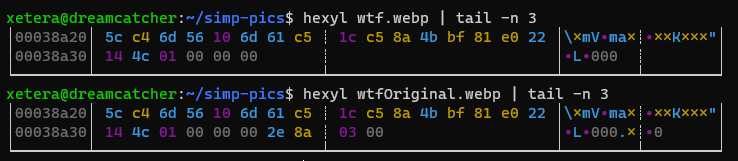

import { Image } from "astro:assets"
import WideMedia from "🧱/article/WideMedia.astro"
export const Toastable = ({ text }) => <span>{text}</span>

export const ExampleImage = ({ title, text, size, children, src }) => {
  return (
    <article class="not-prose flex-1 bg-body-800 min-w-[260px] font-sans">
      <div class="rounded overflow-hidden max-w-full mb-4">
        
      </div>
      <div class="flex justify-between items-center px-4 py-1">
        <h3 class="not-prose text-lg md:text-xl color-text-600 m-0 font-bold">{title}</h3>
        <p class="m-0 text-sm font-bold px-3 py-1 rounded bg-body-500">
          {size}
        </p>
      </div>
      <p class="m-0 p-4 leading-relaxed text-lg">{text}</p>
    </article>
  )
}

If you're going to be accepting and serving images in your webserver, it's a good idea to make sure they don't take up HUGE amounts of space. Storage doesn't grow on trees you know. A portion of what makes images take up a lot of space is its quality, images that look better take more space than those that look 💩.

File formats are another portion of that puzzle. Not all formats were created the same, something like GIF is an incredibly wasteful format as it stores each individual frame separately whereas something like MP4 stores the transitions between frames which makes it vastly more efficient for representing animation.

WebP is one of those file formats that allow for lossy compression in a way that (on average) makes high resolution images look better than what JPEG provides.

import handongWebp from "./assets/handong.webp"

<div class="flex flex-wrap mb-4 gap-4">
  <ExampleImage
    src="/article-assets/converting-webp/handong.png"
    title="😔 Virgin PNG"
    size="7.1MB"
    text="That's crazy. Nobody wants to download this file and you don't want to serve
it either."
  />
  <ExampleImage
    src={handongWebp.src}
    title="😎 Chad WebP"
    size="433KB"
    text={
      <>
        Now this is the good stuff. Look at how much smaller that is. Imagine
        not using webp in {new Date().getFullYear()}.
      </>
    }
  />
</div>

export const Reduction = () => (
  <Toastable text="6x+ reduction in file size" class="text-indigo-300">
    The example image is optimized to load faster on your browser. These values
    are from the raw images that were used.
  </Toastable>
)

Can you see the difference? I sure can't. Try opening them in a new tab and zoom in, it's still not noticeable. The conversion from Png WebP here is saving us that many bytes which makes the image load faster. That's a <Reduction /> for free.

There are some implications of using improved file formats of course. A browser first has to be able to support the file format that you're using so outdated browsers like Internet Explorer and Safari don't support it fully.

## Getting Started

Let's get started with converting images in Javascript by installing the basic dependencies. Make sure you use the `npm` version of these commands if you're not on yarn.

```sh
$ yarn add fluent-ffmpeg
```

We're going to be using ffmpeg to do our image conversions. If you're not familiar with ffmpeg, it's the god tool for working with any kind of media. Images, sound, videos, gifs, subtitles. It'll take anything and modify it in any way you want. Here's a simple example that works on the commandline.

```sh
$ ffmpeg -i image.png image.jpeg
```

export const Jpeg = () => (
  <Toastable text="Jpeg" class="text-green-300">
    JPEG and JPG refer to the exact same file type, just with different names.
  </Toastable>
)

Nothing too fancy here, we're simply setting `image.png` as the input file and turning it into a `image.jpeg`. Ffmpeg is able to infer that we want a <Jpeg /> output We can also pass in any kind of option we want. If we're converting to WebP, we can control the quality of the resulting file through these options.

```sh
$ ffmpeg -i image.png -quality 50 image.webp
```

This will produce a fairly low quality but an amazingly small webp version of our image. The default ffmpeg value for webp images is 75 which I find to be adequate but you can feel free to play around with it as you like.

CLI programs can be a bit of a pain to run so let's jump on fluent-ffmpeg which is a more convenient version of the api.

```ts {title: "lib/image.ts", lines:true}
import ffmpeg from "fluent-ffmpeg"
import * as fs from "fs"
import { Readable } from "stream"

function convertImage(imagePath: string, outputName: string) {
  ffmpeg().input(image).saveToFile(outputName)
}

convertImage("./image.png", "./image.webp")
```

This produces the same output as the one above, but it's not very practical, let's look at an express example where a user uploads an image using `multipart/form-data`.

```ts {lines: true}
import express from "express"
import multer from "multer"
import fs from "fs/promises"
import { convertImage } from "./lib/image"

const upload = multer({ dest: "uploads/" })

const app = express()

app.post("/profile", upload.single("avatar"), async (req, res, next) => {
  convertImage(req.file.path, "./image.webp")
  // image.webp is now available on disk
})
```

That's it, that's all you need to convert images to webp, wasn't so problematic was it? Except there's a problem, this method of doing conversions is extremely inefficient. We're writing the original file to disk first even though we just end up reading it again right afterwards. Thankfully multer allows only saving things in memory without writing to disk with the following.

```ts {lang:false}
const upload = multer({ storage: multer.memoryStorage() })
```

<p class="text-sm leading-7">
  There are basically no other multipart parsers that do this. I spent many
  hours looking and multer was the only one. Kinda crazy...
</p>

Images, which are just binary data in memory, are represented with the `Buffer` data type and ffmpeg by default takes a file path. Being a CLI program, we can pipe a stream of bytes into it in the CLI like this.

```
$ cat image.png | ffmpeg -i pipe:0 image.webp
```

In english terms that's equivalent to

> Take the contents of image.png, _pipe_ it across this program which takes its input from `pipe:0` and convert it to image.webp.

`pipe:0` here being stdout that we pushed the contents of image.png into. If you're not familiar with unix pipes definitely check look into them.

In fluent-ffmpeg, doing this kind of piping requires the input to be a `ReadableStream`. The conversion between Buffers and Streams is a bit hacky and it involves manually disabling some internal methods but it's doable and works just fine.

```ts {title: "lib/image.ts", lines:true}
import { Readable } from "stream"

function convertImage(image: Readable, outputName: string) {
  ffmpeg().input(image).saveToFile(outputName)
}

export function bufferToStream(buffer: Buffer): Readable {
  const readable = new Readable()
  readable._read = () => {}
  readable.push(buffer)
  readable.push(null)
  return readable
}
```

this now lets us patch the previous function like so.

```ts {lines: true}
import express from "express"
import multer from "multer"
import { bufferToStream, convertImage } from "./lib/image"

const upload = multer({ storage: multer.memoryStorage() })

const app = express()

app.post("/profile", upload.single("avatar"), async (req, res, next) => {
  const stream = bufferToStream(req.file.buffer)
  convertImage(stream, "./image.webp")
  // image.webp is now available on disk
})
```

This method works pretty well but we still have the same issue on the _other end_. We're saving an image to disk but often we want to do something like upload it to S3 or save it somewhere else and writing the image to a file ends up being a pointless operation that takes time and resources. For this example we're going to pretend we want an output we can pass along to the AWS sdk to upload on S3 instead of saving on disk. https://wasabi.com is a great service for this.

Thankfully, ffmpeg allows outputting a stream just as it allows for a stream input. To do that we will use a `PassThrough` stream which, as the name states, just passes the stream through. We use this to capture the output of the conversion.

```ts {title: "lib/image.ts", lines:true}
import { Readable, PassThrough } from "stream"

function convertImage(image: Readable, outputFormat: string) {
  const passthrough = new PassThrough()
  ffmpeg()
    .input(image)
    .outputFormat(outputFormat)
    .stream(passthrough, { end: true })
  return passthrough
}
```

Now that we're passing a stream to ffmpeg it can no longer infer what filetype it needs to turn the image into so we need to explicitly tell it that we're looking to convert to a specific format.

For testing purposes, we can try writing this to a file manually.

```ts {lines:true}
app.post("/profile", upload.single("avatar"), (req, res, next) => {
  const stream = bufferToStream(req.file.buffer)
  const output = convertImage(stream, "webp")
  output.pipe(fs.createWriteStream("./image.webp"))
})
```

Aaand it work- wait... what the hell is this?


The file is corrupted?? What on Earth could be going on?

## Debugging stream issues

The exact same command we tried worked with a file, why is it not working with a stream as opposed to a file target? To start debugging this, we first need to understand how the webp spec works and how ffmpeg interacts with streams.

The webp spec says that images need to have the block size of the file at the beginning of the file like so.


A working webp image will have a file size signature where the image size is between the first 4th and 7th bytes.


However, when we pipe the data directly out of ffmpeg without writing to disk using this command (which is the equivalent of the original problematic js code).

```
$ cat image.png | ffmpeg -i pipe:0 -f webp pipe:1 > output.webp
```

The exact same file looks like this... why?


Essentially, ffmpeg doesn't know the size of the image as it's going over it so it uses 4 null bytes `00 00 00 00` as a placeholder and plans to seek back to the beginning of the image when it's done to replace it with the size of the image it just read. Except when piping to stdout, ffmpeg is unable to seek back. Try to see if you can spot where the missing `2e 8a 03 00` bytes might have gone instead of the header.



I'm not sure why, but instead of warning you that piping a webp output to stdout will not work, ffmpeg decides to go ahead and just do it anyways and adds the file size at the end of the image. This will likely be fixed in the future by failing with a warning, but as of version 4.2.4, ffmpeg does weird things with webp outputs. (The same thing applies for other file formats that have block sizes in the header like FLAC files).

One interesting caveat to this is if the image is small enough for ffmpeg to read in one go without separating into multiple chunks (less than a handful KBs), it doesn't have to seek back to the beginning and will properly include the file size in the header from the start.

## Putting it Together

This bug isn't the end of the world for us though. We can fix it by simply moving the last 4 bytes of the image into the 4-7 byte position. Javascript has very efficient methods on typed arrays and buffers that let us move data around without much overhead called `copyWithin` and `slice`. `copyWithin` is similar to the performant memcpy and memmove in C (it even has the same gross type signature) and `slice` returns a view without copying anything much like the `&str` type in Rust. Definitely _not at all_ confusing with `Array.prototype.slice` which is often used to explicitly copy arrays. Good job Javascript.

One problem we run into when implementing this fix is that streams are not directly editable and we have to consume the entire stream first and then concat the chunks into a single buffer before we can start picking apart the bytes.

```ts {title: "lib/image.ts", lines:true}
import { Readable, PassThrough } from "stream"

function convertImage(image: Readable, outputFormat: string) {
  return new Promise((resolve, reject) => {
    const chunks: Buffer[] = []
    const passthrough = new PassThrough()
    ffmpeg()
      .input(image)
      .outputFormat(outputFormat)
      .on("error", reject)
      .stream(passthrough, { end: true })
    passthrough.on("data", data => chunks.push(data))
    passthrough.on("error", reject)
    passthrough.on("end", () => {
      const originalImage = Buffer.concat(chunks)
      const editedImage = originalImage
        // copy everything after the last 4 bytes into the 4th position
        .copyWithin(4, -4)
        // trim off the extra last 4 bytes ffmpeg added
        .slice(0, -4)
      return resolve(editedImage)
    })
  })
}
```

And it worked!

<WideMedia>


</WideMedia>

Now we can publish to s3 easily with

```ts {lines: true, name: "lib/upload"}
import express from "express"
import multer from "multer"
import { S3, Endpoint } from "aws-sdk"
import { credentials } from "./config"
import { bufferToStream, convertImage } from "./lib/image"

const upload = multer({ storage: multer.memoryStorage() })
const app = express()

export const wasabi = new S3({
  endpoint: new Endpoint("s3.wasabisys.com"),
  credentials,
  s3ForcePathStyle: true,
})

app.post("/profile", upload.single("avatar"), async (req, res, next) => {
  const stream = bufferToStream(req.file.buffer)
  const output = await convertImage(stream, "webp")
  await wasabi
    .putObject({
      Bucket: process.env.MY_BUCKET,
      ContentType: "image/webp",
      Key: "test.webp",
      Data: output,
    })
    .promise()
})
```

And that's all! You have an optimized webp optimized image uploader for your app. You might want to also convert to some fallback formats like jpeg if you want to support older browsers just in case.
