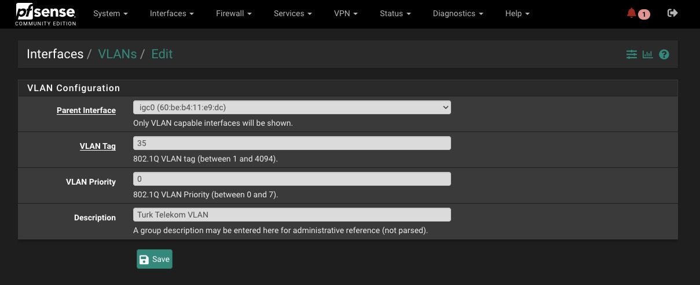
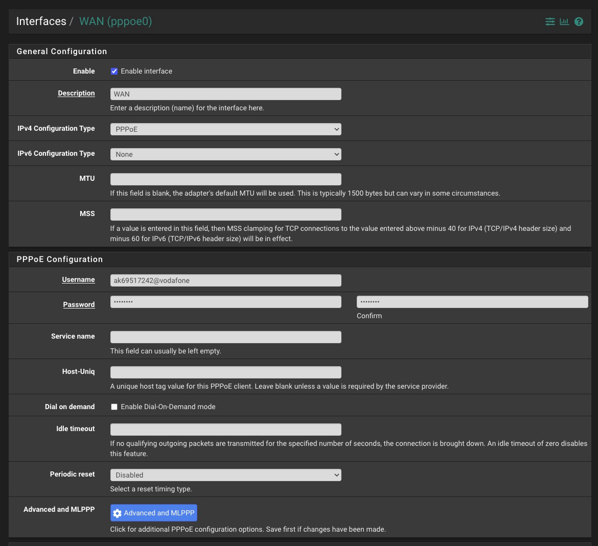

import Callout from '🧱/article/Callout.astro'
import T from '🧱/T.astro'
import ExternalLink from '🧱/ExternalLink.astro'

<Callout title="TLDR">
  I've made <ExternalLink class="inline-flex text-blue-400" href="https://github.com/xetera/router-freedom">a cross-platform desktop app</ExternalLink> that can help you find the credentials if you're not interested in the technical details.
</Callout>

For the past few years, I've been using all the time I don't spend writing new articles setting up a homelab. That includes getting a new small server that I use for home-assistant, a cool access point, a network switch, and of course, my own router. I've also somehow ended up with a 100TB Plex collection now sitting in a data center and thousands of dollars sunk in completely unnecessary hardware for it. I didn't *have* to do any of these, but once you go down this rabbit hole there's no coming back.

My setup was working great until I had to move to a new apartment and realized that my current ISP couldn't guarantee gigabit speeds there. I was being demoted from gigabit speeds to a mere 100mbps, that's 1/10th the speed I was getting at my old place! You can argue I don't need gigabit but.. I mean I clearly *need* gigabit. How am I supposed to repeatedly run `docker pull xetera/abandoned-project` with a measly 100 mbit/s internet?

I started looking around for a new ISP I could switch to, and when I found one that told me my building has fiber support, I learned an important lesson about what "fiber internet" means for ISPs. There's this incredible marketing hype around fiber, as if customers care what material their cables are made of. Every neighborhood is being upgraded to fiber connections, and these ISPs are mentioning incredible technological advancements with it. But what they won't tell you, or will do so reluctantly, is that their fancy new fiber is limited to asymmetric VDSL speeds. 100 mb/s down 10 mb/s up. All these companies seem to have found a way to turn government subsidies and a long term cost-saving investment —laying fiber for new customers instead of copper— into some hype most people don't even understand. I certainly didn't at first.

After some more digging, I saw that an ISP promising gigabit speeds had their flyer hung on my apartment entrance the whole time I was doing my little online hunt, along with the phone number of the fiber manager guy in charge. At that moment, I somehow immediately got over my millenial fear of making phone calls through sheer willpower alone, and rang the guy up. He said he could promise 500mbps speeds, but not anything higher because my apartment had <T>Fiber to the Building</T> (FTTB) meaning there'd have to be a potential long run of ethernet cabling from the ONTs in the basement, reducing top speeds. I'm not sure how I responded to him after that, talking to someone with technical knowledge instead of getting random buzzwords thrown at me left me in a haze. By the next day, the guy and his crew were already over to hook up my internet. Everything was looking great.

Once I had my new internet working, I asked this new “director of fiber internet” how I could go about getting the PPPoE password of the router so I can swap it out with my own router, the way I did with my previous ISP by clicking on a button on their Android app. His response was devastating. "Oh I don't know, they don't even tell me my own router's password. Let me know if you figure out how to find it."

That really scared me since I had no clue if it was even possible to find it. But after some digging and experimenting, I ended up figuring it out later that day.

**Mr. Director of Fiber Internet, if you're reading this, here's how.**

## Changing your router

If you're lucky enough to have an ISP using DOCSIS, you can likely get away with setting your ISP modem to bridge mode and just connect your own router on the other end and everything will just work. Not the case for me unfortunately.

Alternatively, your first option for digging up that password is to just see if your router shows it to you in its Web UI. A lot of ISPs I'm familiar with ship custom firmware with their routers that disable options like custom DNS configuration for censorship reasons. And the ones that don't ship with custom firmware, often have a write-only field for it and don't send the plaintext password to the UI. So I only mention this option in passing. It will probably not work.

You could try to hack the router and use some kind of vulnerability to get access into it and its configuration, but honestly that sounds like a lot of work. Many ISP routers have a management interface usable through the protocol TR-069, but in my experience even if you get access to it, you can only get your username out of it and not the password.

Thankfully, there is a much better third option, which is to MITM the router and find out its juicy secrets. For this, instead of connecting a device you own to your router, you'll be connecting your router to a device you control. But to get there, you'll first need to become familiar with the different protocols used for getting a router online.

### PPPoE

With fiber, the ONT authenticates the physical link to the ISP infrastructure. And particularly if you live in a third world country, your ISP uses an ancient protocol called Point-to-Point over Ethernet (PPPoE) for session authentication on top of that.

When your router turns on, it broadcasts a packet in order to discover if there's a PPPoE server on the other end to authenticate itself against. This authentication happens with a username and password, but ISPs often also take the device MAC address into account and won't authorize your device if it's coming from a device they didn't give you. There's almost always going to be a VLAN with specific configuration involved as well. Mine sets the VLAN tag to 0 for example, which is not even in the range of valid VLAN IDs.

### Asking for the password politely

There are two ways routers authenticate themselves against whatever they're connected to based on what the server asks for after a session has been established over PPPoE. There's `CHAP`, where a 3 way handshake between the client and server is used to solve a challenge, similar to what you'd expect from a modern login method. In contrast there's `PAP`, where your device essentially yells all of its secrets into the void and hopes nobody is listening. Similar to a dispute between two cavemen in 1200 B.C (around when PPPoE was first created). This is what we'll use to find the password. Don't get it twisted though, this is an <T>ancient</T> protocol which means CHAP is barely better than PAP. Yes the challenge includes a salt and makes rainbow tables unusable but it uses MD5 (and sometimes DES)! Even if your router uses CHAP, the password can easily be cracked by modern hardware.

I actually don't think the latter is necessarily dangerous even though it's obviously insecure. You need to have physical access to a router to do any damage and, as far as I know, there aren't many recorded cases of customers getting their devices hijacked through this route. Which makes me even angrier that ISPs say they can't give you that password for safety purposes. Bullshit.

Let's connect the router to the computer you're running. An important thing to note is you <T>NEED</T> to have a PPPoE server running on the other end to get to the point where your router is ready to log in and expose its credentials. Otherwise you'll only see packets where the router is looking for a server and nothing more. If you can't do this, read until the end for an automated tool that does all of it for you.

I already have an external router running pfsense, so I've connected the ISP router to the `igc3` interface on my pfsense machine. If you're also a pfsense user, you can tell which interface you've connected to by going

import interface_ from "./assets/interface.png"
import WidePicture from "🧱/article/WidePicture.astro"
import WideMedia from "🧱/article/WideMedia.astro"

<WideMedia>
  <WidePicture
    noBorder
    alt="screenshot of pfsense showing interface assignments"
    aspectRatio="10:4"
    src={interface_}
  />
</WideMedia>

Before the router powers up, we want to already be dumping all the network communication on that interface with wireshark. Assuming you already have ssh access to your machine, running this command lets us pipe tcpdump into wireshark and take a look under the hood.

<WideMedia contain>
```shell
wireshark -k -i <(ssh root@10.0.0.1 tcpdump -i igc3 -U -w -)
```
</WideMedia>

I personally use `10.0.0.0/8` for my home subnet because I'm awesome. If you haven't done this kind of thing before or don't know what a subnet is, you're most likely set up with `192.168.1.1` by default.

After powering on the router and waiting a bit for it to wake up, we should start seeing `PADI` packets that the router sends to initiate the PPPoE handshake. We haven't set up a PPPoE server on the other side yet so these packets falls into the void with no response. Most routers are set up to retry discovery to prevent falling into a do-nothing state. In my case, you can see it retries every 30 seconds.

import padi from "./assets/padi.png"

<WideMedia contain>
  <WidePicture
    noBorder
    alt="screenshot of pfsense showing interface assignments"
    src={padi}
  />
</WideMedia>

Here's what the steps of an average conversation over PPPoE looks like:

- `PADI` Your router's broadcast over the network it's connected to see if there's a server out there.
- `PADO` The server response to the broadcast. This is basically the pong to the router's ping that contains extra information like the name of the server, and a session cookie used to keep track of the conversation.
- `PADR` The request your router sends to establish a connection using the existing session it received from the previous step.
- `PADS` The server acknowledgement of `PADR` packets. After this step your server can start sending PPP configuration packets to negotiate the settings that will be used to go online.
- `PADT` The termination packet. I've seen one of my routers sending this before sending a `PADI` packet, probably to make sure any potentially existing sessions are dropped? It can also be sent by the server if they want to take you offline for whatever reason.

Here's a full interactive wireshark exchange between the router and the PPPoE server.

import a from "./assets/_turktelekom.json"
import { Timeline } from "🧱/Pcap.tsx"

<WideMedia extraWide>
  <Timeline client:visible pcap={a}></Timeline>
</WideMedia>

Obviously the authentication fails because we don't have a real PPPoE server and it doesn't know any users, but that's not relevant. We already have everything we need to replace this router now. Let's grab the credentials from the `Authenticate-Request`. The MAC address from the ethernet frame and the VLAN ID from the 802.1Q frame.

Create a new VLAN with the right configuration and attach it to the WAN interface:

<WideMedia>
  
</WideMedia>

If you're using Superonline or another ISP that sets its VLAN to 0, you're going to need to do this by manually editing config files in pfSense since that's not a valid tag there.

Then update your new router's PPPoE config for WAN (not my real credentials don't worry)

<WideMedia extraWide>
  
</WideMedia>

Your MAC address also needs to be updated but I can't for the life of me figure out how this is done in pfSense for WAN interfaces. So I've set it manually for igc0 using shell commands. I'm sure I'm just missing something obvious.

And that's it. If your router uses CHAP, you're going to need to crack the hash somehow. Knowing the pattern is going to be helpful for configuration. From my experimentation I've found that different Turkish ISPs have different password patterns, namely:

- `Superonline` digits only `[0-9]{10}`
- `Turk Telekom` lowercase alphanumerical `[0-9a-z]{10}`

Which should take less than a day on modern GPUs. Let me know know if you have findings you'd like to share. I'd love to build a database of these findings.

If you don't or can't follow these instructions I've created a free and [open source desktop application](https://github.com/xetera/router-freedom) that can pretend to be a PPPoE server and do a full handshake to extract the right variables. I'd like to eventually turn this into a tool that works for all kinds of routers with different configurations.
