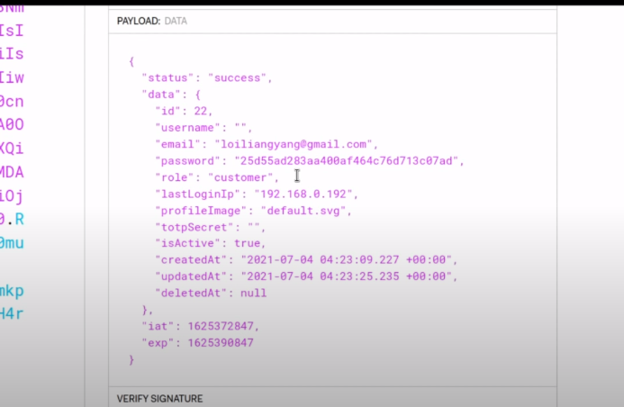
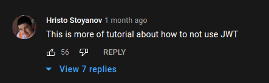
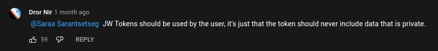

import T from '🧱/T.astro'
import Callout from '🧱/article/Callout.astro'
import WideMedia from '🧱/article/WideMedia.astro'

I love the internet as a resource for learning new things. I love YouTube as an easily accessible, exciting source of information for beginners. I have a long article describing [just how much of a fan I am of online learning](/article/why-does-school-suck-so-much), but it comes with its own set of problems.

Teaching is not simple; communicating ideas takes a lot of very intentional effort to pull off successfully. It's easy for people who don't have a full grasp of a topic or find it difficult to convey what they do know well to unintentionally spread misleading --or sometimes straight-up incorrect-- information. In my experience, most channels that spend time creating online content do their due diligence and make sure what they're putting out is high quality and correct, but this is not always the case.

I want to specifically talk about one video today, which I think is a pretty egregious example of what I mean.

<WideMedia>
  <iframe
    width="560"
    height="315"
    src="https://www.youtube-nocookie.com/embed/MEyyegfvhwM"
    title="YouTube video player"
    frameborder="0"
    allow="accelerometer; autoplay; clipboard-write; encrypted-media; gyroscope; picture-in-picture"
    allowfullscreen
  />
</WideMedia>


## What's wrong with this video

Now, right off the bat, the title... I don't know. It's a bit weird, but I guess you gotta hustle and get views, right? I don't like it, but it doesn't change the content; it's just a red flag that makes this video stand out to me as potentially low quality. It's just ever so slightly sus.

As a quick summary, the person in the video is going through an [OWASP Juice Shop](https://github.com/bkimminich/juice-shop)
setup and demonstrating an injection vulnerability with user creation. It allows him to modify the payload in the user create endpoint to include properties that get sent directly to the database without any validation. This kind of thing can happen on a backend that looks something like this.

```js
app.post("/user", async (req, res) => {
  // no checks, send everything straight into the database baby
  const result = await db.createUser(req.body)
  res.json(result)
})
```

Now, this is a pretty serious vulnerability, but it's not realistic for big websites. It can happen with an inexperienced developer using a cringe backend like Express.js where there's no validation built into the webserver and zero type-safety, but it's not something you're going to be running into in the wild very often. Injection is literally #1 in [the OWASP list of top 10 web vulnerabilities](https://owasp.org/www-project-top-ten/), so it's clearly a big problem. However, simple injection exploits like these are not going to be found in the first place you'd be looking for them, like a sign-up form. You probably don't make mistakes calculating something like 20 + 10 if you're double-checking and have people going over your work as well.

The way Loi finds out this vulnerability (I hope that's his name, I haven't watched this YouTube channel before) isn't really discussed, and he tries to sell the process he's going through as something that works for any website; which is obviously not true, but we can suspend our disbelief in the name of clickbait magic for now. In the video, he points out that the backend is storing sensitive information in the JSON Web Token (JWT) issued to the user and goes through it to find potentially juicy information.



This isn't an incorrect observation since there's a `password` and `totpSecret` field in there, which are definitely scary-sounding fields I don't want to see in my client. But the critical thing to note here is that this layout of the JWT with all the unexpected "sensitive" content lets an attacker infer that there might be a missing sanitization step between fetching user data and creating a JWT. The JWT claims might represent the exact structure of what a user row in the database might look like since a carefully crafted token would probably not contain these fields. The data stored in the JWT is <T>NOT</T> a vulnerability or a security problem by itself, as these fields should only be accessible by the user the token is being issued to. It's just a strong clue for an attacker that gives insight into what the backend might be doing wrong.

The step of inspecting the JWT gave Loi an idea of what the database schema of the site looks like, and it let him make a good guess for how he could change a payload that might be lacking validation from its inputs; the same way it lacked validation for its outputs. It's not actually a part of the vulnerability he ends up exploiting, and yet, he keeps going on about storing sensitive information in a JWT the entire time and never once mentions injection, which is the real culprit here. <T>Why?</T>

He later goes to the user registration page, pulls up burp suite, and talks about how the JWT thing is making it possible for him to create a new user with premium, which makes no sense. The roles in the JWT are not insecure or sensitive. It's not uncommon to store user roles in a JWT as it's signed, and a user can't change it. If there was proper validation being done, the JWT would've made zero difference, and the exploit wouldn't be possible. These two things are not in the least bit related to each other. This exploit is still possible with or without a JWT storing information that is not even sensitive to begin with.

{<Callout>
  <p class="text-base">
    The only problems that arise from storing user roles in tokens are
    logistical, and not security-related. For example, if you store roles in a
    token, you have to reissue the user a new token when you want to change
    their roles which can be kind of a pain to deal with if you don't have a
    flexible setup for that sort of thing.
  </p>
</Callout>}

It's also possible to set claims on a token without straight-up dumping an entire DB row into it and giving attackers insight into your DB schema and your app's security flaws.

This was clearly something that confused viewers, seen by comments like these from people who convinced themselves that they just became experts on stateless authentication after watching a video of an exploit that had nothing to do with JWTs.





I understand that these types of videos are meant to wow beginners and maybe get them excited about security, which is awesome! But the way this video is presented seems like it's meant more for experienced devs, with the way it's filled with a lot of technical jargon that would not be very useful for a beginner. It almost feels like it's an attempt to impress inexperienced people with a bunch of complicated technical stuff by someone who forgot that there are people who understand what he's talking about watching the video. I don't like this at all. This person is clearly experienced in this field and is someone that plenty of people look up to as an expert, yet he's not doing a good job communicating his knowledge clearly.

I'm all for showing cool stuff to people to get them interested in a field. But there are plenty of beginners who are still learning about these concepts who consume the content people like this guy create as a foundation for their knowledge, and that has some serious implications in situations like these. There's a way to combine being engaging and being correct, but it's not always easy. If you're willing to compromise this much on the latter part, I don't think you should be creating educational content, or at the very least, content that leads viewers to believe they just learned something new from an expert.

<hr class="mb-6" />

Btw, huge shoutout to the one person in the comments who actually understood what was going on lmao.


